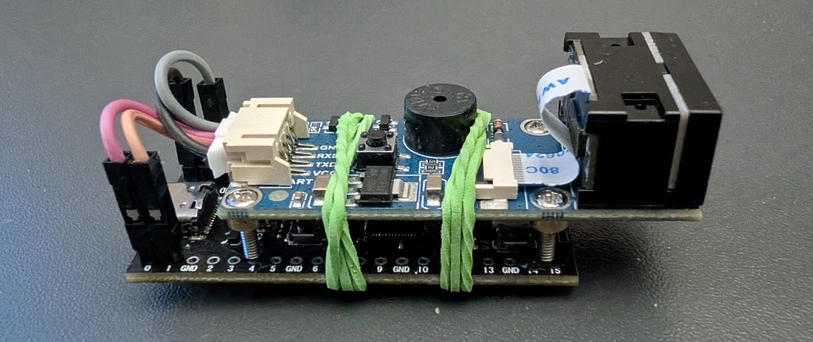

  <picture>
    <source media="(prefers-color-scheme: dark)" srcset="brand/logo-dark.svg">
    
  </picture>

  A programmable USB barcode scanner that types scans into forms, field by field.
   
  RP2040 plus a 1D/2D scanner module, no drivers, nothing to install on the host.

  
  
  

---

  

Plug the scanner in, hold a barcode or QR code in front of it, and the decoded
value is typed into the active window as if someone had entered it on a keyboard.
Works on any operating system that accepts a USB keyboard.

What makes it different from an off-the-shelf scanner are **profiles**: the device
recognises the kind of code it just read, splits it into fields and types them in
a defined order with TAB and ENTER in between, straight into the matching boxes of
a form. Everything is configured from a web page served by the scanner itself, off
a small read-only disk it exposes over USB.

## What it does

- works the moment it is plugged in, exactly like a USB keyboard,
- scans on presentation, without pressing a button,
- splits codes into fields and fills forms, GS1 codes included (product number,
  expiry date, batch, serial number),
- guards against duplicate scans and paces typing for slow applications,
- needs nothing installed to be configured: open `configurator.html` from the
  scanner's own disk,
- fills forms **by field name** where a fixed TAB order is too fragile — in a
  browser through an extension, in Windows applications through an optional
  tray agent,
- updates by dragging one file; release packages are built by CI.

## Start here

**[Documentation](docs/README.md)** — eight pages, starting with
[Getting started](docs/getting-started.md): what to buy, how to wire it, how to
flash it and how to make the first scan land in a form.

Ready-to-use packages are under [Releases](https://github.com/Mysttic/mysttic-barcode-scanner/releases);
the sources build from scratch as described in
[Contributing](docs/CONTRIBUTING.md).

## Licence

Apache License 2.0, see [LICENSE](LICENSE) and [NOTICE](NOTICE). Components from
other projects that ship in the release package are listed in
[third-party notices](docs/THIRD-PARTY-NOTICES.md).

The documentation and the interfaces are in English. The configurator, the
extension and the agent each offer Polish as a second language.
