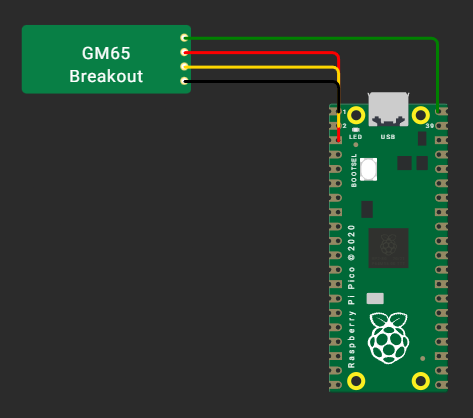

# Czytnik kodów 1D/2D — programowalna klawiatura USB

Podłączasz czytnik do komputera, zbliżasz kod kreskowy lub QR — odczyt wpisuje się
w aktywne okno, tak jakby ktoś przepisał go z klawiatury. Bez sterowników, bez
instalowania czegokolwiek na komputerze, na dowolnym systemie.

To, co wyróżnia urządzenie, to **profile**: czytnik sam rozpoznaje rodzaj kodu
i potrafi rozłożyć go na pola, wpisując je w zadanej kolejności z klawiszami
TAB/ENTER — np. prosto w kolejne rubryki formularza. Wszystko konfiguruje się
stroną WWW otwieraną z pendrive'a czytnika.

## Co potrafi

- działa od razu po podłączeniu, jak zwykła klawiatura USB,
- skanuje automatycznie po zbliżeniu kodu (bez wciskania przycisku),
- tnie kody na pola i wypełnia formularze (w tym kody GS1: numer towaru,
  data ważności, partia, numer seryjny),
- pilnuje duplikatów i tempa wpisywania (przyjazne dla wolnych aplikacji),
- konfiguracja bez instalacji — strona `konfigurator.html` z pendrive'a czytnika,
- wtyczka do przeglądarki wypełnia formularze **po nazwach pól** tam, gdzie
  sekwencja TAB-ów jest zbyt krucha (obce strony, SPA),
- aktualizacje przez przeciągnięcie pliku, paczki wydań budowane automatycznie.

## Od czego zacząć

| Chcę... | Zajrzyj do |
|---|---|
| zbudować / zainstalować czytnik | [docs/INSTALL.md](docs/INSTALL.md) |
| skonfigurować skanowanie i profile | [docs/KONFIGURACJA.md](docs/KONFIGURACJA.md) |
| wypełniać formularze (wszystkie warianty) | [docs/FORMULARZE.md](docs/FORMULARZE.md) |
| wypełniać formularze po nazwach pól na obcych stronach | [docs/WTYCZKA.md](docs/WTYCZKA.md) |
| nauczyć wtyczkę nowego formularza (samouczek) | [docs/NAUKA-PROFILU.md](docs/NAUKA-PROFILU.md) |
| wypełniać formularze w aplikacjach desktopowych (moduł opcjonalny) | [docs/AGENT-DESKTOP.md](docs/AGENT-DESKTOP.md) |
| przetestować urządzenie (scenariusz „od pudełka", testy, e2e) | [docs/TESTING.md](docs/TESTING.md) |
| sprawdzić, co system umie, a czego nie (i jakie kody) | [docs/MOZLIWOSCI.md](docs/MOZLIWOSCI.md) |
| zobaczyć plany rozwoju | [docs/ROADMAP.md](docs/ROADMAP.md) |
| poznać szczegóły techniczne | [docs/ARCHITEKTURA.md](docs/ARCHITEKTURA.md) |
| prześledzić decyzje projektowe | [docs/decisions.md](docs/decisions.md) |
| zobaczyć historię zmian | [CHANGELOG.md](CHANGELOG.md) |

Na dysku samego czytnika (`CZYTNIK`) jest komplet do pracy bez repozytorium:
konfigurator, instrukcje (`INSTRUKCJA.md`, `WTYCZKA.md`, `NAUKA-PROFILU.md`)
i formularze testowe (`testy.html`).

## Schemat połączeń (minimum)

| Pin modułu skanera | Przewód (nasza wiązka) | Pin płytki RP2040 |
|---|---|---|
| VCC | zielony | 5 V (VBUS, pin 40) |
| GND | czerwony | GND (pin 3) |
| TXD | żółty | **GP1** (pin 2) |
| RXD | czarny | **GP0** (pin 1) |

Szczegóły montażu i rozwiązywanie problemów: [docs/INSTALL.md](docs/INSTALL.md).

## Wydania

Gotowe paczki instalacyjne: zakładka **Releases**. Rozwój odbywa się na gałęzi
`develop`; proces wydawania i testów opisuje [docs/TESTING.md](docs/TESTING.md)
oraz [docs/ARCHITEKTURA.md](docs/ARCHITEKTURA.md).
