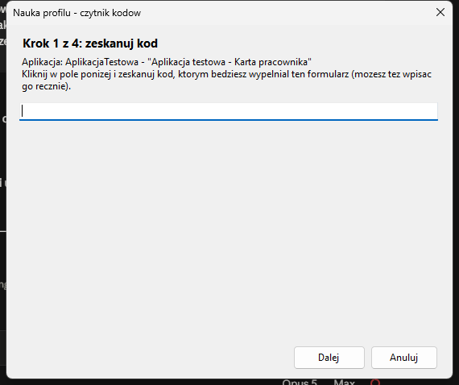
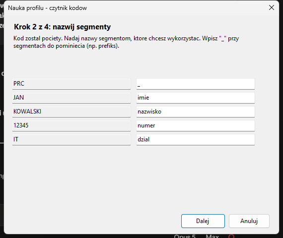
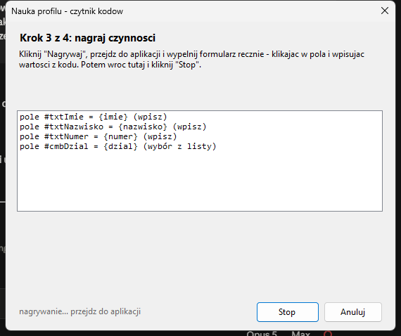
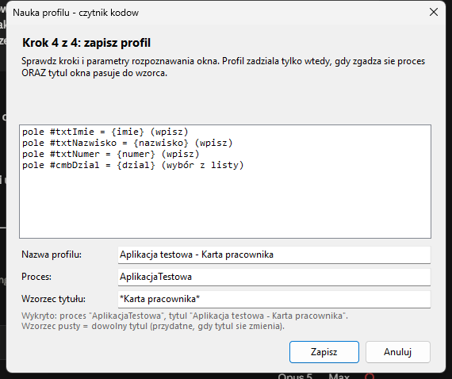
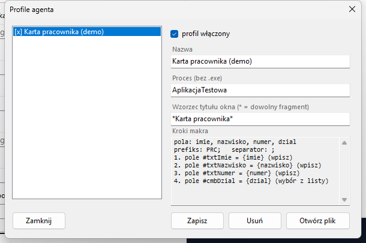

# Agent desktopowy — wypełnianie formularzy w aplikacjach

Wtyczka przeglądarkowa działa tylko w przeglądarce. Agent desktopowy robi to
samo w **zwykłych aplikacjach Windows**: rozpoznaje okno, przechwytuje skan
i odtwarza nauczone makro.

**Moduł jest opcjonalny.** Bez niego czytnik działa dokładnie jak dotąd
(wariant A: sekwencje TAB-ów). Agent instaluje się osobno i tylko wtedy, gdy
klient go potrzebuje.

> **Status: prototyp roboczy.** Ścieżka „skan → rozpoznanie okna → wypełnienie
> pól" jest przetestowana automatycznie (34 asercje jednostkowe + 27 e2e na
> żywej aplikacji, łącznie ze skanem w stylu prawdziwego czytnika i pracą
> na plikach z gotowej paczki wydania). Nie była jeszcze sprawdzona
> z fizycznym czytnikiem ani w prawdziwym kiosku — to najbliższy krok.

## Zasada działania

| Sytuacja | Co robi agent | Co widzi operator |
|---|---|---|
| okno pasuje do profilu | przechwytuje skan i odtwarza makro | dymek „Wypełniono: kroki 4/4" |
| okno bez profilu | **nic** — nie dotyka klawiatury | czytnik pisze jak zwykle (TAB-y, passthrough) |

Drugi wiersz jest równie ważny jak pierwszy: poza nauczonymi aplikacjami nic
się nie zmienia. Gdy ramka nie pasuje do profilu, przechwycone znaki wracają do
aplikacji — tak, jakby agenta tam nie było.

**Czytnik i firmware pozostają nietknięte.** Agent słucha klawiatury, bo
czytnik *jest* klawiaturą; działa z konfiguracją produkcyjną urządzenia.

## Jak agent trafia w pola

Trzy strategie, próbowane w tej kolejności:

| Strategia | Kiedy działa | Trwałość |
|---|---|---|
| **UI Automation** (identyfikator kontrolki) | WinForms, WPF, WinUI, Electron, Qt/Java z włączoną dostępnością | wysoka: przeżywa przesunięcie okna, inną rozdzielczość i skalowanie DPI |
| **kliknięcie we współrzędne** (względem okna) | wszędzie, także Citrix/RDP i aplikacje rysujące własny interfejs | niska: przesunięte okno = klik w złe miejsce |
| **wpisanie w aktywne pole** | gdy krok nie ma celu (np. po TAB-ie) | zależy od fokusu |

Nauka zapisuje **obie** informacje naraz (identyfikator kontrolki i pozycję),
więc profil sam schodzi na współrzędne dopiero wtedy, gdy kontrolki nie da się
znaleźć.

Dodatkowo każde wypełnienie jest **weryfikowane odczytem zwrotnym**: agent
sprawdza, czy aplikacja faktycznie przyjęła wartość, i zgłasza błąd zamiast
cicho wpisać dane w próżnię.

## Instalacja

Agent jest w paczce wydania, w katalogu **`agent-desktopowy/`**:

```
agent-desktopowy/
  CzytnikAgent.exe          samodzielny program (nie wymaga instalowania .NET)
  zainstaluj-agenta.ps1     instalator: kopiuje agenta i włącza autostart
  profil-przykladowy.json   gotowy profil do prób
  AGENT-DESKTOP.md          ta instrukcja
  CZYTAJ-MNIE.txt           skrót informacji
```

**Instalacja (zalecana):** kliknij prawym na `zainstaluj-agenta.ps1` →
*Uruchom w programie PowerShell*. Agent trafi do profilu użytkownika
(`%LOCALAPPDATA%\CzytnikAgent`), dostanie skrót w menu Start i będzie
uruchamiany przy starcie systemu. Uprawnienia administratora nie są potrzebne.

| Wariant | Polecenie |
|---|---|
| bez autostartu | `.\zainstaluj-agenta.ps1 -BezAutostartu` |
| odinstalowanie | `.\zainstaluj-agenta.ps1 -Odinstaluj` (profile zostają) |
| bez instalacji | uruchom `CzytnikAgent.exe` bezpośrednio |

Po uruchomieniu w zasobniku pojawia się ikona; pod prawym przyciskiem jest
włącznik, zarządzanie profilami i tryb nauki.

Profile i log trafiają do `%APPDATA%\CzytnikAgent\`
(`profile.json`, `agent.log`).

## Aplikacja testowa (do prób bez systemu produkcyjnego)

Do wydania dołączony jest osobny plik **`aplikacja-testowa-v<wersja>-win-x64.zip`**
— przenośna aplikacja z dwoma ekranami (logowanie, karta pracownika). Pola są
celowo w innej kolejności niż dane w kodzie, są pola-pułapki, lista wyboru,
pole z podpowiedziami i pole hasła, a panel na dole pokazuje, **co aplikacja
naprawdę przyjęła** (nie tylko co widać w polach).

1. Rozpakuj i uruchom `AplikacjaTestowa.exe` (nie wymaga instalacji).
2. Skopiuj `profil-do-agenta.json` do `%APPDATA%\CzytnikAgent\profile.json`
   albo naucz własny profil (Ctrl+Alt+F9).
3. Zeskanuj kod `PRC;JAN;KOWALSKI;12345;IT;Specjalista`.

Tryb kiosku do prób: `AplikacjaTestowa.exe --kiosk`.

## Nauka nowego formularza

Tryb nauki uruchamia **globalny skrót Ctrl+Alt+F9** — działa również wtedy, gdy
aplikacja pracuje w trybie kiosku na pełnym ekranie i nie da się kliknąć
w zasobnik.

1. Otwórz formularz, którego chcesz nauczyć, i naciśnij **Ctrl+Alt+F9**.

2. **Krok 1 — zeskanuj kod.** Kliknij w pole kreatora i zeskanuj kod, którym
   będziesz wypełniał ten formularz. Znaki nie trafiają do formularza.



3. **Krok 2 — nazwij segmenty.** Agent tnie kod (sam dobiera separator);
   nadaj nazwy segmentom, wpisz `_` przy tych do pominięcia (np. prefiks).



4. **Krok 3 — nagraj czynności.** Kliknij „Nagrywaj", przejdź do aplikacji
   i wypełnij formularz **ręcznie**: klikaj w pola i wpisuj wartości z kodu,
   używaj TAB-ów i ENTER-a jak zwykle. Potem wróć i kliknij „Stop".
   Lista pokazuje na bieżąco, co agent zapamiętał.



5. **Krok 4 — zapisz.** Agent zamienia wpisane wartości na odwołania `{pole}`,
   scala „kliknięcie + wpisanie" w jeden trwały krok z identyfikatorem
   kontrolki i pokazuje gotową listę kroków. Widzisz tu też **parametry
   rozpoznawania okna** — nazwę profilu, proces i wzorzec tytułu — wszystkie
   do poprawienia przed zapisem. Pusty wzorzec tytułu = dowolny tytuł, co jest
   właściwe dla aplikacji zmieniających tytuł okna (odtwarzacze, przeglądarki).



Kreator pojawia się w **prawym dolnym rogu** ekranu, na którym stoi uczona
aplikacja, żeby nie zasłaniać formularza.

**Sposób nauki decyduje o sposobie wypełniania.** Jeśli w pole *wpisywałeś*
tekst, agent też będzie w nie wpisywał; jeśli *wybierałeś pozycję z listy*,
agent będzie wybierał. To rozróżnienie jest istotne dla pól wyszukiwania
z podpowiedziami: w drzewie kontrolek wyglądają jak listy wyboru, choć są
zwykłymi polami tekstowymi.

Od tej chwili sam skan wypełnia formularz — **profil działa natychmiast, bez
restartu agenta**. To samo dotyczy zmian wprowadzonych bezpośrednio w pliku
`profile.json`: agent obserwuje plik i przeładowuje go po zapisaniu (przydatne
przy prowizjonowaniu stanowisk gotowym plikiem).

## Zarządzanie profilami

Ikona w zasobniku → **Profile (zarządzaj)**: włączanie i wyłączanie profilu,
zmiana nazwy, poprawianie **procesu i wzorca tytułu okna**, podgląd kroków
makra oraz usuwanie. Przycisk *Otwórz plik* pokazuje `profile.json` do
ręcznej edycji albo skopiowania na inne stanowiska.



## Format profilu

Celowo bliźniaczy do profilu wtyczki: *gdzie* → *jak rozłożyć kod* → *co zrobić*.

```json
{
  "Nazwa": "Karta pracownika (ERP)",
  "Wlaczony": true,
  "Match": { "Proces": "erp", "TytulWzorzec": "*Karta pracownika*" },
  "Parse": {
    "Typ": "delimited",
    "Prefiks": "PRC;",
    "Separator": ";",
    "Pola": ["_", "imie", "nazwisko", "numer", "dzial"]
  },
  "Kroki": [
    { "Akcja": "pole", "Cel": { "AutomationId": "txtImie" }, "Wartosc": "{imie}", "Tryb": "wpisz" },
    { "Akcja": "pole", "Cel": { "AutomationId": "cmbDzial" }, "Wartosc": "{dzial}", "Tryb": "wybierz" },
    { "Akcja": "klawisz", "Klawisz": "TAB" },
    { "Akcja": "tekst", "Wartosc": "kadry" },
    { "Akcja": "klik", "Cel": { "X": 120, "Y": 380 } },
    { "Akcja": "pauza", "Ms": 200 }
  ]
}
```

| Akcja | Znaczenie |
|---|---|
| `pole` | wpisz wartość (szablon z `{pole}`) do wskazanej kontrolki; `Tryb`: `wpisz` / `wybierz` / `auto` |
| `tekst` | wpisz tekst w aktywne miejsce |
| `klawisz` | TAB, ENTER, ESC, F1–F12, strzałki, HOME/END, DELETE, BACKSPACE |
| `klik` | kliknij kontrolkę albo punkt (współrzędne względem okna) |
| `pauza` | odczekaj podaną liczbę milisekund (wolne aplikacje) |

Typy parsowania (`Parse.Typ`): `delimited`, `regex` (grupy jak w urządzeniu),
`gs1` (AI 01/17/10/21, data „00" = koniec miesiąca) — te same reguły i te same
wektory testowe co firmware i wtyczka.

## Ustawienia

Sekcja `Ustawienia` w `profile.json`:

| Klucz | Domyślnie | Znaczenie |
|---|---|---|
| `OdstepSkanuMs` | 60 | maksymalna przerwa między znakami uznawana za skan |
| `MinDlugoscRamki` | 3 | krótsze ramki są ignorowane |
| `PauzaKrokuMs` | 40 | pauza między krokami makra (zwiększ w wolnych aplikacjach) |
| `WeryfikujOdczytem` | true | potwierdzanie wypełnienia odczytem zwrotnym |

## Ograniczenia

- **Aplikacja uruchomiona jako administrator** wymaga, żeby agent też działał
  z podniesionymi uprawnieniami (mechanizm UIPI) — inaczej nie wpisze do niej
  danych.
- **Citrix/RDP i aplikacje rysujące własny interfejs** nie wystawiają kontrolek
  do UI Automation — zostaje wariant współrzędnych (kruchy) albo sekwencja
  TAB-ów z profilu czytnika.
- **Pola haseł nie są wypełniane nigdy** (świadome ograniczenie).
- Agent zakłada hook klawiatury — część polityk firmowych i pakietów
  antywirusowych może to blokować. Docelowa alternatywa: odbiór danych
  kanałem szeregowym z czytnika (tryb `host`), bez hooka — patrz
  [ROADMAP.md](ROADMAP.md).
- Po aktualizacji aplikacji identyfikatory kontrolek mogą się zmienić i profil
  trzeba nauczyć od nowa.

## Diagnostyka

`%APPDATA%\CzytnikAgent\agent.log` zawiera każdą rozpoznaną ramkę i wynik
każdego kroku makra. Czy dana aplikacja w ogóle nadaje się do celowania po
identyfikatorach, sprawdzisz poleceniem:

```bash
CzytnikAgent.exe --drzewo --proces nazwa_procesu
```

Jeśli kontrolki mają puste `id` i `nazwa`, trzeba będzie oprzeć profil na
współrzędnych albo na sekwencji TAB-ów.
