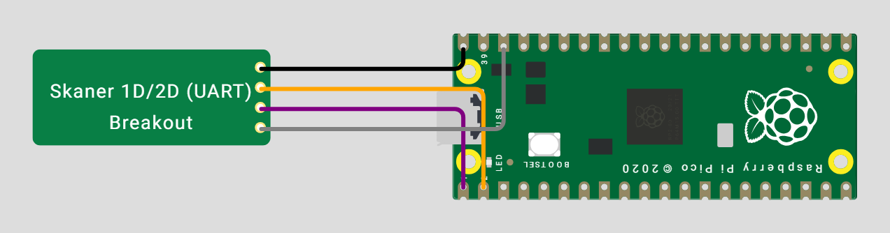

# Hardware

What to buy, how to wire it, and where to get the scanner module's own
documentation.

## Bill of materials

| Part | What we used | Notes |
|---|---|---|
| MCU board | **Raspberry Pi Pico** or a clone (YD-RP2040) | must be an RP2040 with **native USB**; boards with a USB-serial bridge will not work |
| Scanner module | **Waveshare 14810** (Barcode Scanner Module, 1D/2D, UART and USB output) | this is the unit everything here was built and tested against; GM65 and GM805 modules work the same way and take the same configuration barcodes |
| Cable | 4-wire harness, usually supplied with the module | JST on the module side |
| USB cable | any **data** cable | charge-only cables are the single most common cause of "nothing happens" |
| Optional | a push button on GP2, an LED on GP6 | factory reset and status; the module has its own buzzer |

The scanner module is the expensive part and the one that decides which
symbologies you can read. Everything else is a commodity RP2040 board.

## Wiring

Pin order on our module's connector (Waveshare 14810), counting from pin 1:
`VCC | TXD | RXD | GND`. **Other modules order them differently** — some GM65
boards read `GND | RXD | TXD | VCC`, and some Waveshare variants
`VCC | GND | TXD | RXD` — so read the silkscreen on the board you actually have
instead of copying the picture.

| Module pin | RP2040 pin | Note |
|---|---|---|
| VCC | 5 V (VBUS, pin 40) | the module needs 5 V, not 3.3 V |
| TXD | **GP1** (pin 2) | UART crosses over |
| RXD | **GP0** (pin 1) | UART crosses over |
| GND | GND (pin 38, or any other GND) | connect ground first |

The wire colours in the diagram are arbitrary; they are there to tell the four
wires apart. The colours of the harness that ships with a module follow no
convention either, so **always go by the pin labels**, never by colour.

The module powers from 5 V but signals at 3.3 V (measured on our unit), which is
safe to wire straight into the RP2040. Some datasheets for this family quote a
5 V TXD, and RP2040 GPIOs are not 5 V tolerant, so **measure TXD against GND on
your own module before connecting it**: an idle UART line sits at logic high, so
a powered, idle module should read about 3.3 V. If it reads 5 V, put a 1 kΩ / 2 kΩ
divider on TXD.

The easiest mistake to make here is swapping GND with one of the data lines, or
wiring TXD straight to GP0. UART crosses over: the module's **TXD goes to GP1**
(the Pico receives) and its **RXD goes to GP0** (the Pico transmits). Ground
goes to any GND pin, never to a GPIO.

A Wokwi simulation of the circuit, including a small chip model of the scanner,
is in [hardware/wokwi](../hardware/wokwi/README.md).

## The module's own documentation

The module's command manual and datasheet are **copyrighted by the
manufacturer**, so they are not redistributed in this repository. For the
Waveshare unit they are on the
[Barcode Scanner Module wiki](https://www.waveshare.com/wiki/Barcode_Scanner_Module)
(the "Setting Manual" PDF); for GM65 boards, search for "GM65 barcode scanner
module user manual". Both carry the same configuration barcodes. You need them
for two things:

1. the **"Series Output"** configuration barcode, which switches the module from
   USB output to UART (a new module may arrive in either mode),
2. the **"Induction Mode"** barcode, which makes it read as soon as a code is
   presented, with no trigger.

Both settings can also be applied over UART instead of scanning barcodes: see
`firmware-circuitpython/setup_induction.py`, which sends the commands (`7E 00 …`
plus a CRC16-XModem, zone bit 0x0000) and stores the mode in the module's EEPROM.

## Which symbologies work

Decoding happens entirely inside the module, so its manual defines the full list.
The ones **we have physically tested** are EAN-13, QR (text frames) and
DataMatrix ECC200 (GS1 with a GS separator, both off a screen and off a printout).
See [CAPABILITIES.md](CAPABILITIES.md) for what the profile layer does with them.

## USB identity

The firmware presents itself as `1209:0001`. VID `0x1209` belongs to
[pid.codes](https://pid.codes/), a registry for open-source hardware, and PID
`0x0001` is the identifier reserved there **for testing**. That is the right
choice for a device you build for yourself. If you intend to place a product on
the market, request your own PID (https://pid.codes/howto/) and change
`USB_PID` in `firmware-pico-sdk/src/usb_descriptors.c`.

## Enclosure

There is no enclosure design in the repository yet; it is on the
[roadmap](ROADMAP.md) together with a PCB. Until then a breadboard or a soldered
perfboard is what this has been tested on.
