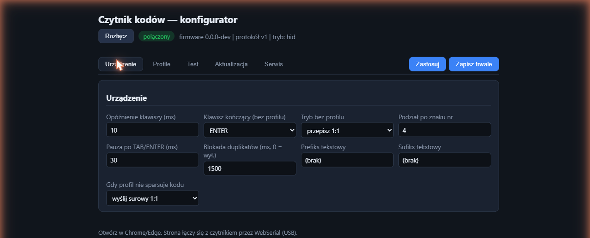
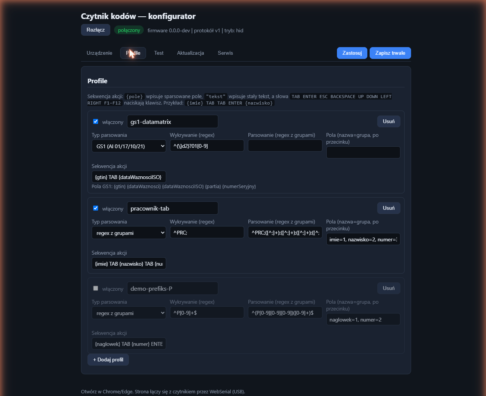
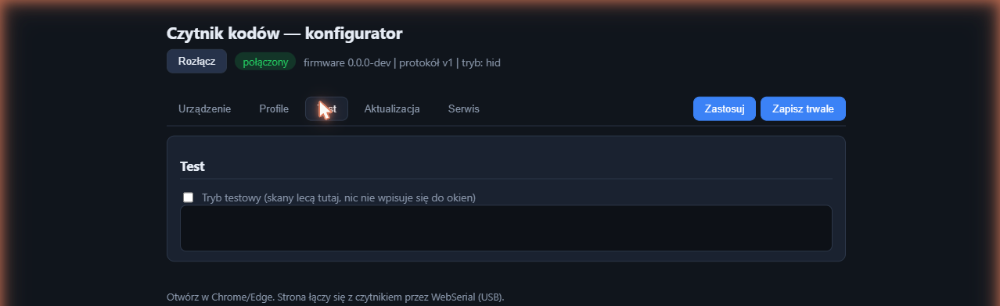
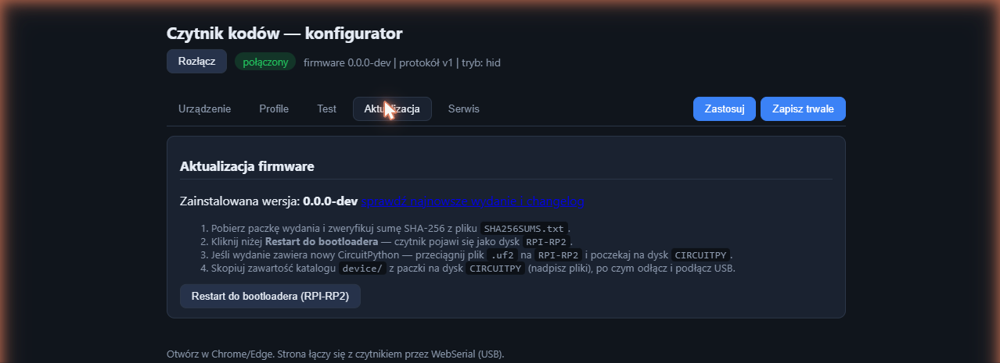

# Konfiguracja skanowania i profile

## Połączenie z konfiguratorem

1. Otwórz **`konfigurator.html`** z pendrive'a czytnika (`CIRCUITPY`) w Chrome/Edge.
   Możesz też użyć kopii z paczki wydania albo z repo — łączy się tak samo.
2. Kliknij **Połącz** i wybierz port „Urządzenie szeregowe USB":
   - firmware produkcyjny (C): jest **jeden** port,
   - firmware prototypowy (CircuitPython): wybierz **drugi** z dwóch
     (pierwszy to konsola — timeout przy połączeniu = przełącz na drugi).
3. Nagłówek pokaże wersję firmware i tryb pracy, a pod nim pojawi się pasek
   zakładek: **Urządzenie · Profile · Test · Aktualizacja · Serwis**.

Przyciski **Zastosuj** i **Zapisz trwale** są zawsze widoczne po prawej stronie
paska zakładek i dotyczą całej konfiguracji (ze wszystkich zakładek naraz):

- **Zastosuj** — wysyła konfigurację do RAM; działa natychmiast, znika po
  odłączeniu zasilania. Do szybkich prób.
- **Zapisz trwale** — utrwala konfigurację w pamięci czytnika; przeżywa
  restarty i aktualizacje.

## Zakładka „Urządzenie"



Ustawienia globalne — obowiązują niezależnie od profili:

| Ustawienie | Znaczenie |
|---|---|
| Opóźnienie klawiszy (ms) | pauza między znakami — zwiększ, gdy aplikacja gubi znaki |
| Klawisz kończący (bez profilu) | co nacisnąć po wpisaniu kodu bez profilu; zwykle ENTER |
| Tryb bez profilu | co robić z kodem niepasującym do żadnego profilu: **przepisz 1:1** albo **podziel (splitAt)** |
| Podział po znaku nr | miejsce cięcia dla trybu „podziel" (kod → część 1, TAB, część 2) |
| Pauza po TAB/ENTER (ms) | dodatkowy czas na przeskok fokusu w wolnych aplikacjach |
| Blokada duplikatów (ms) | ten sam kod w tym oknie czasu wpisze się raz (0 = wył.) |
| Prefiks / sufiks tekstowy | stały tekst doklejany przed/po kodzie (tryb bez profilu) |
| Gdy profil nie sparsuje kodu | **wyślij surowy 1:1** albo **pomiń skan** |

Na zrzucie widać ustawienia fabryczne: 10 ms między znakami, 30 ms po
TAB/ENTER, blokada duplikatów 1,5 s, kody bez profilu przepisywane 1:1
i kończone ENTER-em.

## Zakładka „Profile" — serce urządzenia



Profil mówi: **które kody łapać** (wykrywanie), **jak je pociąć na pola**
(parsowanie) i **co wpisać** (sekwencja akcji). Kody niepasujące do żadnego
włączonego profilu przepisują się 1:1.

Na zrzucie trzy profile fabryczne:

- **gs1-datamatrix** (włączony) — łapie kody zaczynające się od AI `01`
  (z opcjonalnym identyfikatorem symboliki `]d2`), parsuje wbudowanym parserem
  GS1 i wpisuje `{gtin} TAB {dataWaznosciISO}`,
- **pracownik-tab** (włączony) — łapie kody `PRC;…`, tnie po średnikach
  regexem z grupami na pola `imie, nazwisko, numer, dzial` i wypełnia
  formularz TAB-ami,
- **demo-prefiks-P** (wyłączony — karta wyszarzona) — przykład-szablon;
  wyłączone profile zostają w konfiguracji, ale nie działają.

Pola profilu:

- **włączony** — profil działa tylko z zaznaczonym checkboxem,
- **Wykrywanie (regex)** — wzorzec dopasowywany do początku kodu, np. `^PRC;`,
- **Typ parsowania**:
  - *regex z grupami* — wzorzec z nawiasami, np.
    `^PRC;([^;]+);([^;]+);([^;]+);([^;]+)$` + mapa **Pola**: `imie=1, nazwisko=2, numer=3, dzial=4`,
  - *GS1 (AI 01/17/10/21)* — wbudowany parser kodów GS1; pola stałe:
    `{gtin} {dataWaznosci} {dataWaznosciISO} {partia} {numerSeryjny}`
    (podpowiedź z listą pól wyświetla się pod sekwencją),
- **Sekwencja akcji** — co czytnik „wystuka":
  - `{pole}` — wpisuje wartość pola,
  - `"tekst"` — wpisuje stały tekst,
  - `TAB ENTER ESC BACKSPACE UP DOWN LEFT RIGHT F1`–`F12` — naciska klawisz.

Przykłady sekwencji:

```
{imie} TAB {nazwisko} TAB {numer} TAB {dzial} ENTER
{gtin} TAB {dataWaznosciISO} TAB {partia} TAB {numerSeryjny} ENTER
{numer} TAB TAB ENTER TAB {imie} " " {nazwisko}
```

**+ Dodaj profil** tworzy pustą kartę; **Usuń** kasuje profil (zmiana wchodzi
w życie dopiero po „Zastosuj"/„Zapisz trwale", więc pomyłkę cofniesz przyciskiem
„Odśwież z urządzenia" w zakładce Serwis).

Uwaga do wzorców: silnik na urządzeniu wspiera `^ $ . [] * + ? ()` i klasy
`\d \w \s`; kwantyfikatory `{m,n}` rozpisuj jawnie (np. `[0-9][0-9][0-9]`) —
konfigurator pilnuje tego przy zapisie.

## Zakładka „Test"



Zaznacz **Tryb testowy** i skanuj. Każdy skan pojawia się w oknie logu
(surowa treść, dopasowany profil, sparsowane pola), a **nic nie wpisuje się do
okien** — idealne do strojenia profili bez psucia dokumentów. Po zakończeniu
odznacz checkbox (wyłącza się też sam przy rozłączeniu).

### Strony testowe do prób „na żywo"

Do sprawdzenia pełnej ścieżki (skan → klawiatura → formularz) służą gotowe
strony w katalogu [`test-vectors/`](../test-vectors/) repo — otwórz plik
podwójnym kliknięciem w przeglądarce, kliknij pierwsze pole i skanuj kod
wydrukowany/wyświetlony na tej samej stronie:

| Strona | Co testuje | Profil |
|---|---|---|
| [`forma-a-tab.html`](../test-vectors/forma-a-tab.html) | formularz wypełniany po kolei TAB-ami | **pracownik-tab** |
| [`forma-b-nazwy.html`](../test-vectors/forma-b-nazwy.html) | pola w innej kolejności — sekwencję trzeba dopasować do układu formularza | **pracownik-tab** (ze zmienioną sekwencją) |
| [`forma-gs1.html`](../test-vectors/forma-gs1.html) | kod apteczny GS1 DataMatrix: GTIN, data ważności, partia, numer seryjny | **gs1-datamatrix** |

Każda strona zawiera swój kod QR do zeskanowania i opis oczekiwanego wyniku.
Pełny scenariusz odbiorczy: [TESTING.md](TESTING.md).

## Zakładka „Aktualizacja"



Pokazuje zainstalowaną wersję firmware z linkiem do wydań (releases +
changelog) i skróconą procedurę aktualizacji. Przycisk **Restart do
bootloadera** przełącza czytnik w tryb dysku `RPI-RP2` bez sięgania po przycisk
BOOT na płytce. Pełna instrukcja: [INSTALL.md](INSTALL.md).

## Zakładka „Serwis"


- **Odśwież z urządzenia** — porzuca zmiany w formularzu i wczytuje bieżącą
  konfigurację czytnika,
- **Eksport / Import JSON** — kopia zapasowa i przenoszenie konfiguracji
  między urządzeniami (prowizjonowanie),
- strefa czerwona:
  - **Ustawienia fabryczne** — czyści zapis trwały (wraca konfiguracja
    z pliku albo fabryczna),
  - **Restart** — zwykły restart czytnika,
  - **Restart do bootloadera (UF2)** — jak w zakładce Aktualizacja.

## Zapis konfiguracji i priorytety

Źródła konfiguracji w kolejności pierwszeństwa: **zapis trwały → plik
`config/config.json` na pendrivie → ustawienia fabryczne**. Edycja pliku ma
sens przy prowizjonowaniu wielu urządzeń; po pierwszym „Zapisz trwale" to zapis
trwały wygrywa (aż do „Ustawień fabrycznych").

## Ustawienia fabryczne (sprzętowo)

Gdy konfigurator nie działa: przytrzymaj przycisk podłączony do GP2 przez ~1 s
podczas wpinania USB.

## Konfiguracja modułu skanera (jednorazowa)

Tryby pracy samego modułu (wyjście UART, skanowanie po zbliżeniu) ustawia się
kodami z manualu GM65 (`docs/GM65-manual.pdf`, str. 9 i 12) — szczegóły
w [INSTALL.md](INSTALL.md), sekcja 3.
