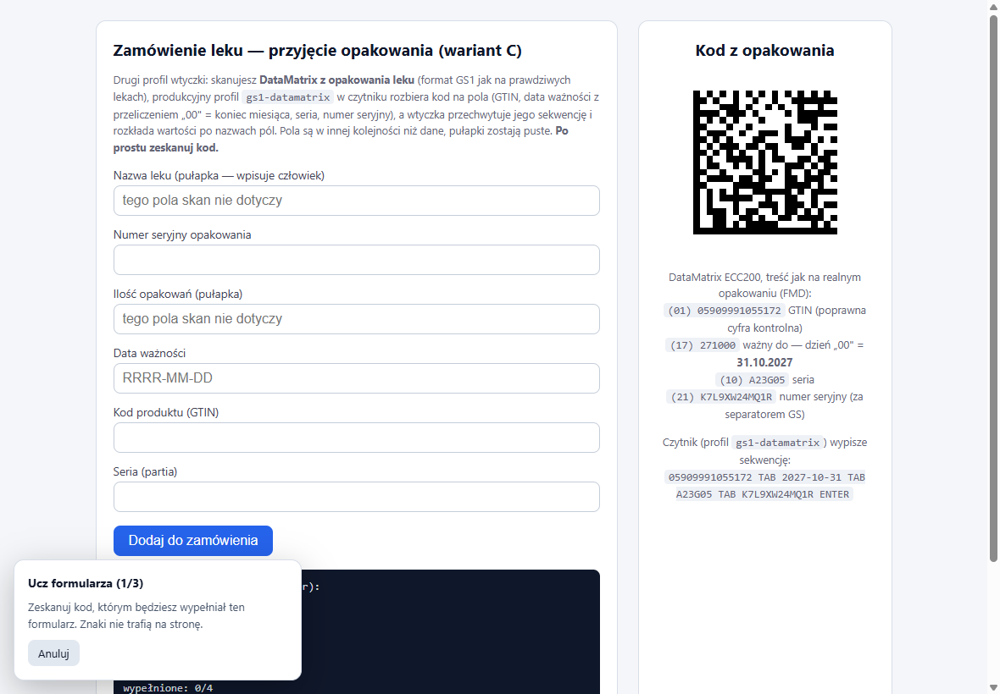
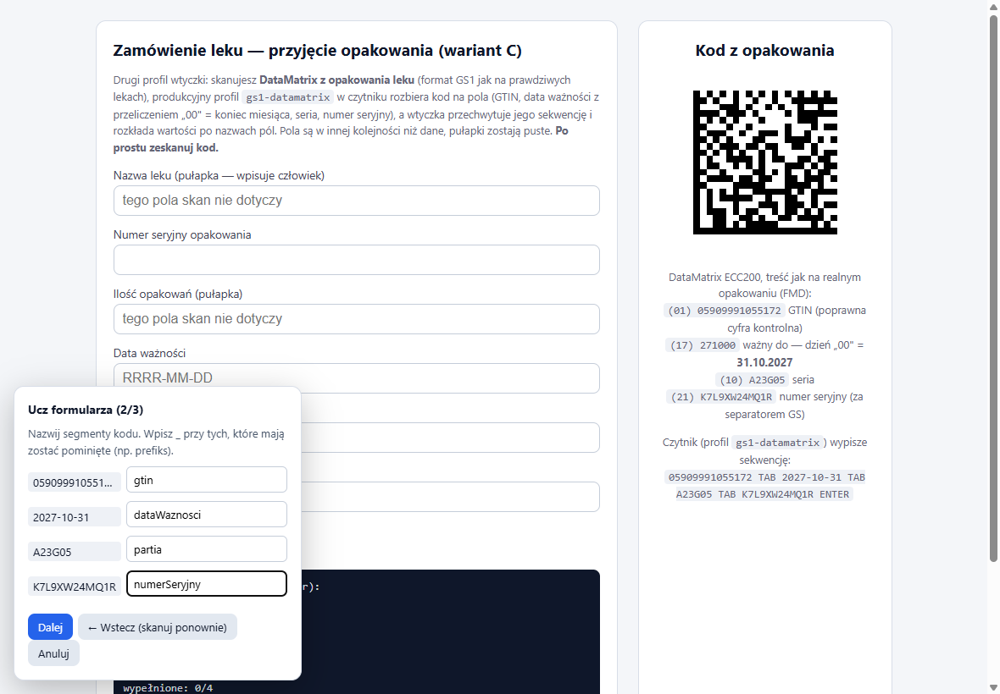
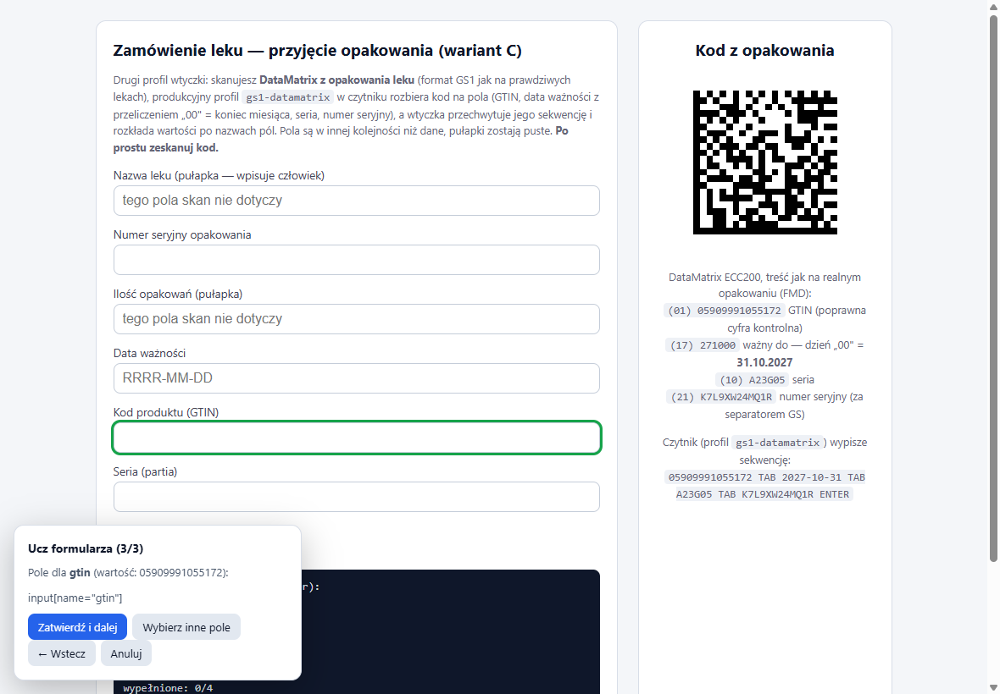
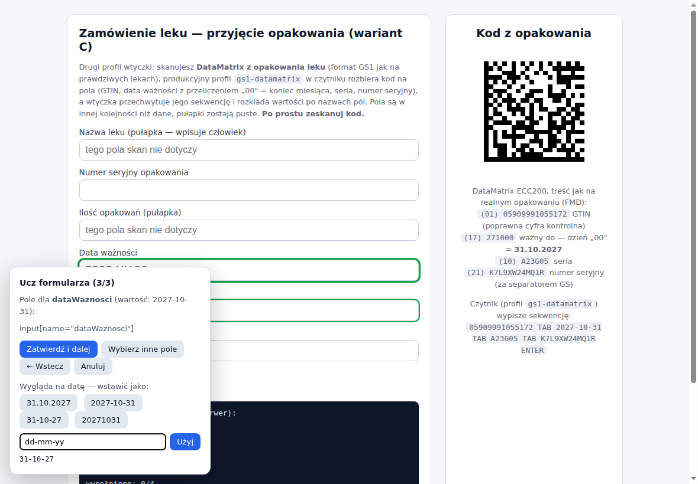
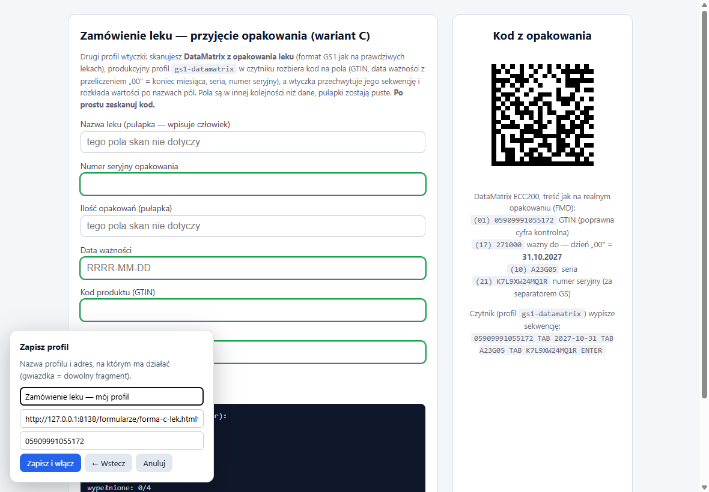
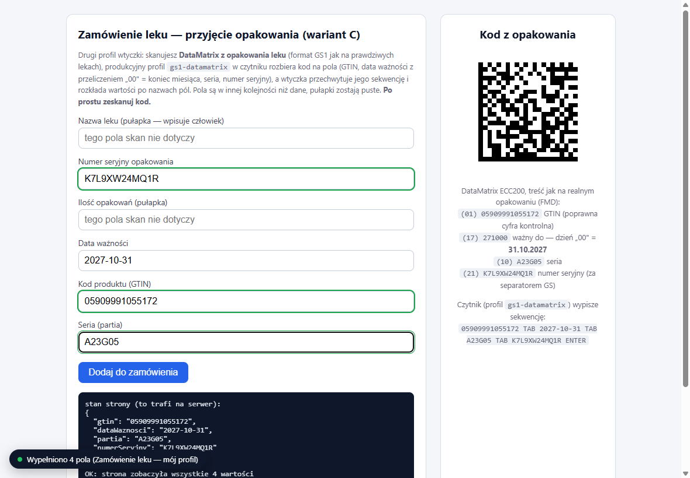

# Nauka profilu wtyczki — samouczek krok po kroku

Tryb nauki to sposób na dodanie obsługi **dowolnego formularza** bez pisania
czegokolwiek: skanujesz kod, nazywasz jego segmenty i klikasz pola, do których
mają trafiać. Profil działa od razu i można go wyeksportować na inne stanowiska.

Ten samouczek przechodzi całość na przykładzie strony **„Zamówienie leku"**
(`formularze/forma-c-lek.html` — na dysku `CZYTNIK` i w repo). Kod to DataMatrix
GS1 jak na prawdziwym opakowaniu leku; czytnik zostaje w zwykłej, produkcyjnej
konfiguracji (profil `gs1-datamatrix` włączony) i przy skanie „wystukuje"
sekwencję: `GTIN TAB data TAB seria TAB numer-seryjny ENTER`. Uczymy wtyczkę,
co z tą sekwencją zrobić na tej konkretnej stronie.

> Do ćwiczeń wyłącz wbudowany profil demo tej strony („Zamówienie leku (demo)"
> w **Profile formularzy**) — inaczej wypełni formularz zanim Twój nauczony
> profil dojdzie do głosu (pierwszy pasujący wygrywa).

## Krok 0 — przygotowanie

1. Czytnik podłączony; wtyczka zainstalowana ([WTYCZKA.md](WTYCZKA.md), sekcja
   „Instalacja").
2. Otwórz formularz, dla którego robisz profil — tutaj: `formularze/forma-c-lek.html`
   z dysku `CZYTNIK` (albo z repo).

## Krok 1 — uruchom naukę i zeskanuj kod

Kliknij **ikonę wtyczki** na pasku → **Ucz formularza**. Pojawi się panel
kreatora (1/3). Zeskanuj kod z opakowania (tu: DataMatrix ze strony) — znaki
**nie trafiają do formularza**, wtyczka tylko je podgląda.

## Krok 2 — nazwij segmenty

Wtyczka sama pocięła to, co wpisał czytnik (rozpoznała separator — tutaj
tabulator z sekwencji TAB-owej), i pokazuje segmenty: po lewej wartości
z Twojego kodu, po prawej pola na nazwy. Wpisz nazwy, które coś dla Ciebie
znaczą — tu: `gtin`, `dataWaznosci`, `partia`, `numerSeryjny`. Segment, który
ma być pominięty (np. stały prefiks), oznacz znakiem `_`.

## Krok 3 — wskaż pola kliknięciem i zatwierdzaj

Kreator pyta po kolei o każdą nazwę i pokazuje, jaka wartość tam trafi.
Najedź na formularz — pole pod kursorem podświetla się — i kliknij właściwe:
dla `gtin` pole „Kod produktu (GTIN)", dla `dataWaznosci` „Data ważności" itd.

Kliknięcie **wybiera** pole (dostaje trwałą zieloną obwódkę), ale nie
przechodzi dalej samo — panel pokazuje wybór i czeka na decyzję:

- **Zatwierdź i dalej** — zapisuje przypisanie i pyta o następną nazwę,
- **Wybierz inne pole** — pomyłka? kliknij po prostu inne pole,
- **← Wstecz** — wraca do POPRZEDNIEJ nazwy (jej przypisanie pokazuje się
  do ponownego zatwierdzenia lub zmiany) — tak poprawisz wcześniejszy wybór,
- **Pomiń pole** — ta nazwa nie ma odpowiednika na tym formularzu.

Przy wartości, która wygląda na datę, panel dokłada rząd przycisków z podglądem
formatów — jeśli Twój formularz chce daty w innej postaci niż kod, kliknij
gotowy wynik zamiast **Zatwierdź i dalej**. Szczegóły:
[WTYCZKA.md → Format wartości wychodzącej](WTYCZKA.md#format-wartości-wychodzącej).

## Krok 4 — zapisz profil

Nadaj profilowi nazwę (np. „Zamówienie leku — mój profil") i sprawdź
podpowiedziany **wzorzec adresu** — profil będzie się włączał tylko na
pasujących stronach (`*` zastępuje dowolny fragment). Przycisk **← Wstecz**
cofa do ostatniego pola, gdybyś chciał jeszcze coś poprawić.
Kliknij **Zapisz i włącz**.

## Krok 5 — sprawdź

Zeskanuj ten sam kod jeszcze raz, **bez klikania w pola**: wartości trafiają
w swoje miejsca (numer seryjny i data ważności we właściwych polach mimo
pomieszanej kolejności), pola-pułapki zostają puste, a dymek potwierdza,
który profil zadziałał. Panel „stan strony" na dole pokazuje, że formularz
naprawdę przyjął wartości.

## Co dalej

- **Zarządzanie** (zmiana nazwy, adresu, kolejności, duplikowanie, usuwanie):
  ikona wtyczki → **Profile formularzy** — opis w [WTYCZKA.md](WTYCZKA.md).
- **Rozesłanie na stanowiska:** tamże **Eksportuj do pliku** → na innych
  komputerach **Importuj z pliku**.
- **Strony do ćwiczeń:** poligon publicznych formularzy treningowych —
  [FORMULARZE.md](FORMULARZE.md), sekcja „Poligon".
