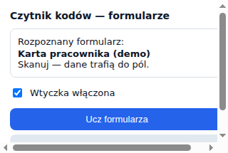
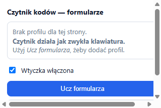
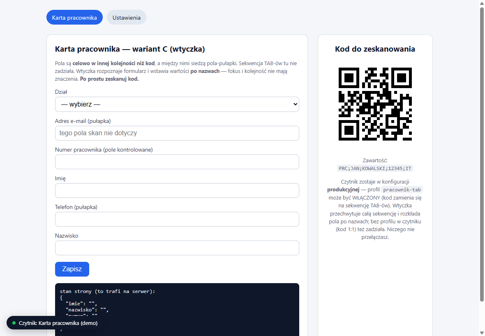
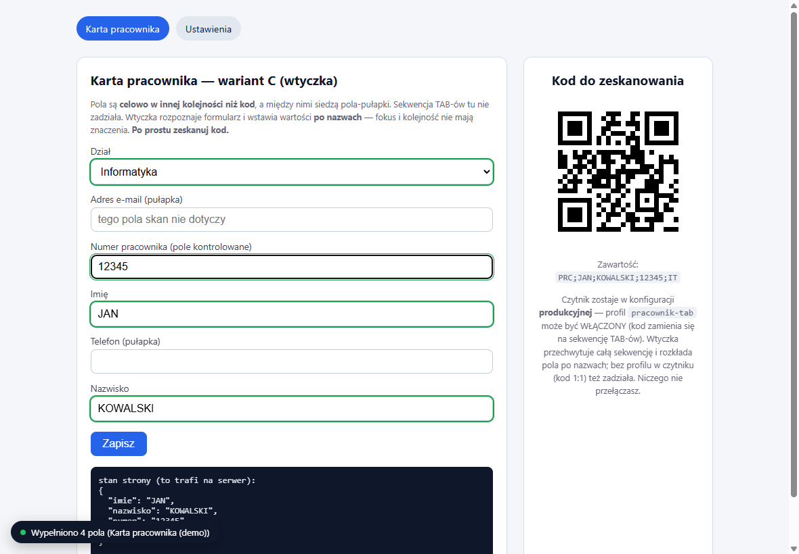
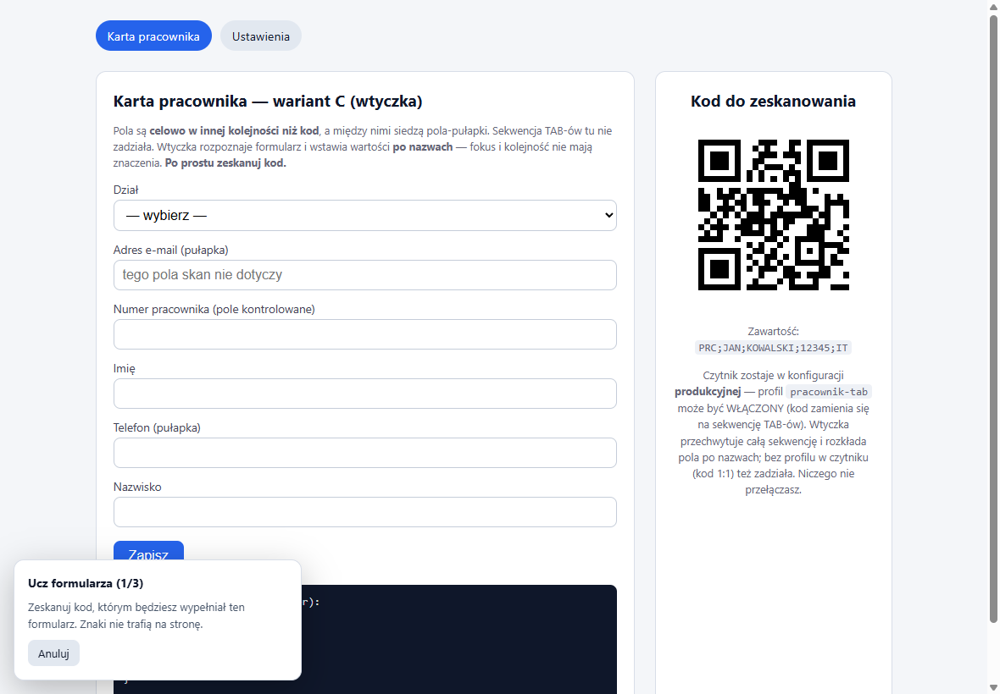
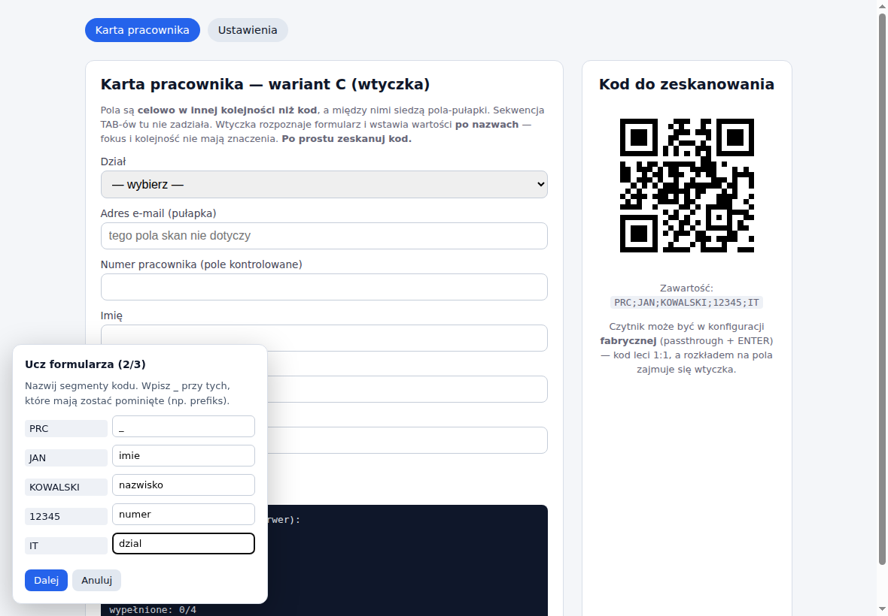
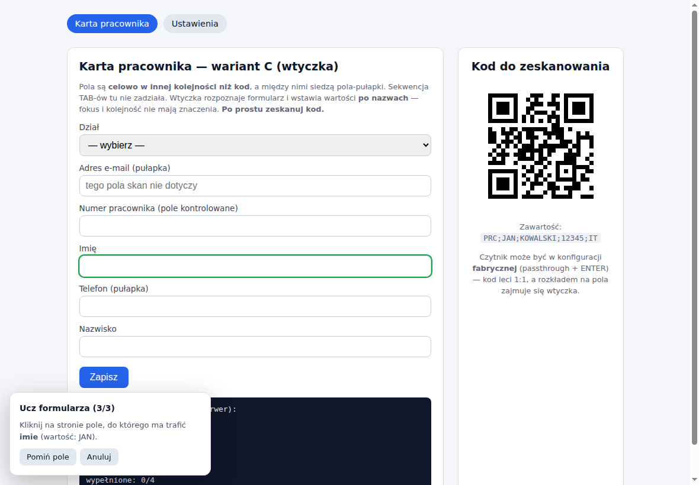
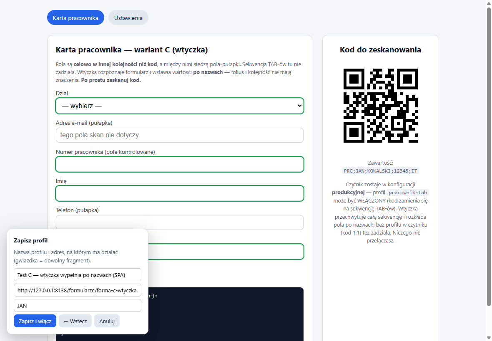
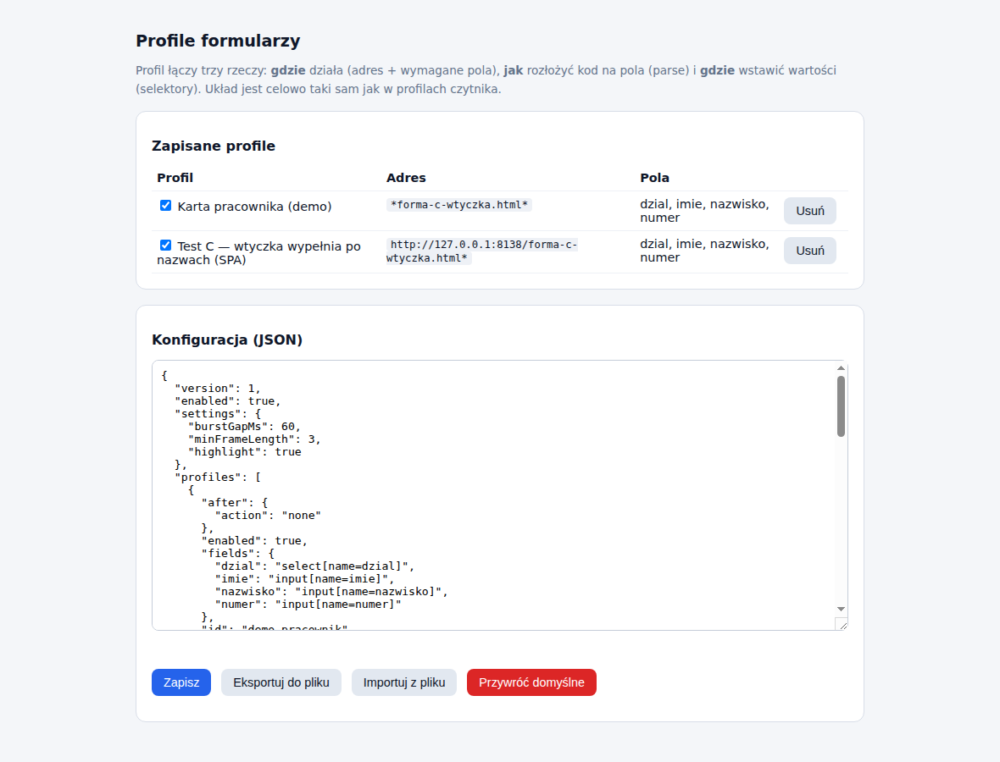

# Wtyczka do przeglądarki — wypełnianie formularzy po nazwach pól

Rozszerzenie produktu dla formularzy, na których sekwencja TAB-ów jest zbyt
krucha: pola w innej kolejności niż dane w kodzie, pola-pułapki między nimi,
strony jednostronicowe (SPA) przebudowujące formularz w locie.

## Zasada działania

Wtyczka jest **pasywna, dopóki nie rozpozna formularza**.

| Sytuacja | Co robi wtyczka | Co widzi operator |
|---|---|---|
| formularz rozpoznany | przechwytuje skan i rozkłada dane po polach **po nazwach** | badge `ON`, dymek „Wypełniono 4 pola" |
| formularz nierozpoznany | **nic** — nie dotyka klawiatury | czytnik pisze jak zwykle (TAB-y, passthrough) |

Przechwytywany „skan" to także **sekwencja TAB-owa z profilu urządzenia**
(profil wtyczki z `parse.separator: "\t"`): czytnik zostaje na stałe
w produkcyjnej konfiguracji z włączonymi profilami, a na rozpoznanych stronach
wtyczka łapie całą serię (TAB-y nie ruszają wtedy fokusa) i rozkłada pola po
nazwach. **Nikt niczego nie przełącza podczas pracy** — na „głupich" stronach
działają TAB-y (wariant A), na rozpoznanych wygrywa wtyczka.

Drugi wiersz jest równie ważny jak pierwszy: poza rozpoznanymi formularzami
nie ma żadnej zmiany zachowania, więc warianty A i B z
[FORMULARZE.md](FORMULARZE.md) działają dalej bez zmian.




Kliknięcie ikony pokazuje, w którym z tych dwóch stanów jesteś: po lewej strona
z rozpoznanym profilem (na pasku dochodzi badge `ON`), po prawej strona bez
profilu — czytnik pisze wtedy jak zwykła klawiatura.

Czytnik i firmware **pozostają nietknięte** — wtyczka nie łączy się
z urządzeniem, tylko słucha klawiatury, bo czytnik *jest* klawiaturą.
Do formularza demo wystarczy konfiguracja fabryczna (passthrough + ENTER).

## Algorytm

**Przy otwarciu strony i przy każdej zmianie widoku w SPA:**

1. weź bieżący adres,
2. znajdź pierwszy włączony profil, którego wzorzec URL pasuje,
3. sprawdź, czy wymagane pola profilu faktycznie są w DOM
   (to odróżnia formularze pod tym samym adresem),
4. jest → aktywuj profil, nie ma → uśpij się.

**Przy skanie (tylko gdy profil jest aktywny):**

5. znaki lecące szybciej niż `burstGapMs` (domyślnie 60 ms) to czytnik,
   nie człowiek — trafiają do bufora ramki (autorepeat przytrzymanego
   klawisza jest ignorowany); przy profilu TAB-owym do bufora trafiają
   też TAB-y z serii (samotny TAB człowieka przechodzi normalnie),
6. ENTER kończy ramkę; przechwycona seria bez ENTER-a wraca do strony
   po 350 ms ciszy,
7. ramka idzie do parsera zgodnie z `parse.type` profilu,
8. wartości trafiają do pól ze słownika `fields`, każde pole jest
   **weryfikowane odczytem zwrotnym**,
9. podsumowanie w dymku + podświetlenie pól (zielone/czerwone).

**Gdy ramka się nie sparsuje**, wtyczka oddaje przechwycone znaki stronie —
tak, jakby jej tam nie było. To gwarancja braku regresji. Przy profilu
prefiksowym TAB w środku ramki nadal przerywa przechwytywanie (to sekwencja
wariantu A dla innej strony); przy profilu TAB-owym TAB-y są częścią ramki.

## Instalacja

1. Chrome/Edge → `chrome://extensions` (Edge: `edge://extensions`).
2. Włącz **Tryb dewelopera**.
3. **Załaduj rozpakowane** → wskaż katalog `wtyczka/` z paczki wydania
   (albo `browser-extension/` z repozytorium).
4. Przypnij ikonę na pasku — badge `ON` pokazuje rozpoznany formularz.

Aby testować formularze z pliku (`file://`), włącz w szczegółach rozszerzenia
**Zezwalaj na dostęp do adresów URL plików**. Prościej: uruchom lokalny serwer
(`python -m http.server 8124` w katalogu `test-vectors`).

## Pierwszy test

1. Otwórz `test-vectors/formularze/forma-c-wtyczka.html` (widok *Karta pracownika*).
2. Badge powinien pokazać `ON`, a w rogu mignąć „Czytnik: Karta pracownika (demo)".



3. Zeskanuj kod ze strony (`PRC;JAN;KOWALSKI;12345;IT`) — **bez klikania w pola**.
4. Cztery pola wypełniają się po nazwach, pola-pułapki zostają puste,
   a panel „stan strony" pokazuje, że strona naprawdę zobaczyła wartości.



Zwróć uwagę na trzy rzeczy naraz: dane trafiły w pola mimo **innej kolejności
niż w kodzie**, pola-pułapki (e-mail, telefon) zostały puste, a `Dział` to
`<select>` — wtyczka dobrała opcję po wartości. Panel na dole to stan
wewnętrzny strony: gdyby wtyczka podmieniła tylko `value` bez zdarzeń,
zostałby pusty i formularz zapisałby się bez danych.

5. Przełącz na zakładkę *Ustawienia* — badge gaśnie. Kliknij w pole i zeskanuj:
   kod wpisze się surowo, jak z klawiatury.

## Drugi przykład — zamówienie leku i przełączanie profili

`test-vectors/formularze/forma-c-lek.html` pokazuje pełny pipeline GS1 i to, że profile
(czytnika i wtyczki) dobierają się same do strony:

1. Na opakowaniu leku jest **DataMatrix GS1** (na stronie: kod o treści jak na
   prawdziwych lekach — GTIN z poprawną cyfrą kontrolną, data ważności `271000`,
   seria, numer seryjny za separatorem GS).
2. Profil **`lek-wtyczka` w czytniku** (w konfiguracji domyślnej, do włączenia)
   parsuje GS1, przelicza datę (dzień „00" = ostatni dzień miesiąca → `2027-10-31`)
   i wypisuje ramkę `LEK;gtin;data;seria;serial` — separator GS nie przechodzi
   przez klawiaturę, więc granice pól wyznacza czytnik.
3. **Drugi profil wtyczki** (wbudowany) rozpoznaje stronę zamówienia i rozkłada
   ramkę po polach: numer seryjny i data ważności trafiają we właściwe miejsca
   mimo pomieszanej kolejności pól.

Przełączanie profili widać wprost: na stronie *Karta pracownika* aktywny jest
profil pracownika (skan leku nic tam nie wypełni), na stronie zamówienia — profil
leku (ramka pracownika zostaje oddana stronie). Badge i dymek zawsze mówią,
który profil jest aktywny. Uwaga: profil `gs1-datamatrix` (TAB-y, wariant A)
łapie te same kody co `lek-wtyczka` — do tego demo musi być wyłączony.

## Dodanie własnego formularza

> Samouczek krok po kroku na pełnym przykładzie (zamówienie leku, kod GS1
> z opakowania): **[NAUKA-PROFILU.md](NAUKA-PROFILU.md)**.

Otwórz formularz, dla którego chcesz zrobić profil, i kliknij ikonę wtyczki →
**Ucz formularza**. Kreator ma trzy kroki.

**Krok 1 — zeskanuj kod**, którym będziesz wypełniał ten formularz. Znaki nie
trafiają na stronę, więc formularz zostaje czysty. Uczysz z tego, co **wpisuje
czytnik** — jeśli jego profil zamienia kod na sekwencję TAB-ową, nauka złapie
ją w całości (segmenty rozdzieli tabulator).



**Krok 2 — nazwij segmenty.** Wtyczka sama tnie kod (dobiera separator spośród
`;` `|` `,` i tabulatora) i pokazuje, co z niego wyszło. Po lewej wartości
z Twojego kodu, po prawej nazwy do wpisania. Segmenty do pominięcia — zwykle
prefiks — oznacz znakiem `_`.



**Krok 3 — klikaj pola i zatwierdzaj.** Wtyczka pyta po kolei o każdą nazwę
i pokazuje, jaką wartość ma tam wstawić. Kliknięcie **wybiera** pole (trwała
zielona obwódka), a panel czeka na decyzję: **Zatwierdź i dalej**, **Wybierz
inne pole** (pomyłka — kliknij inne) albo **← Wstecz** do poprzedniej nazwy,
żeby poprawić wcześniejszy wybór. Pola, których na tym formularzu nie ma,
pomijasz przyciskiem. Wstecz działa też z ekranu zapisu i z kroku nazw
(powrót do skanowania).



**Zapis.** Na koniec nadajesz profilowi nazwę i sprawdzasz wzorzec adresu
(podpowiadany z bieżącej strony) oraz prefiks ramki. Zielone obwódki pokazują
pola, które właśnie przypisałeś.



Profil zapisuje się lokalnie i działa od razu. Gotowe profile można wyeksportować
do pliku (**Profile formularzy** → *Eksportuj*) i rozesłać na inne stanowiska.

## Profile formularzy — dodawanie i zarządzanie

Nowy profil dodajesz na dwa sposoby:

- **tryb nauki** (zalecany) — otwórz formularz, ikona wtyczki →
  **Ucz formularza**, trzy kroki opisane wyżej; profil działa od razu,
- **import** — wczytaj plik JSON wyeksportowany na innym stanowisku
  (prowizjonowanie: jeden inżynier uczy, reszta importuje).

Zarządzanie: ikona wtyczki → **Profile formularzy**. Przy każdym profilu
wprost na liście:

| Operacja | Jak |
|---|---|
| zmiana nazwy | wpisz w polu nazwy — zapisuje się samo (po wyjściu z pola) |
| zmiana adresu (gdzie działa) | pole „adres" — wzorzec z `*`, np. `https://erp.firma.pl/przyjecie*` |
| włącz / wyłącz | checkbox „włączony" (wyłączony profil zostaje na liście) |
| kolejność | strzałki ▲▼ — gdy do strony pasuje kilka profili, **wygrywa pierwszy** |
| duplikowanie | „Duplikuj" — kopia do przerobienia (np. ten sam formularz pod drugim adresem) |
| usunięcie | „Usuń" (z potwierdzeniem) |

Pola, selektory i parsowanie zmienisz w sekcji **Konfiguracja (JSON)** poniżej
listy (całość konfiguracji do ręcznej edycji) — albo po prostu naucz profil
od nowa i usuń stary. **Eksportuj/Importuj do pliku** przenosi komplet profili
między stanowiskami; **Przywróć domyślne** wraca do dwóch profili demo.



## Format profilu

Celowo bliźniaczy do profilu w czytniku: *gdzie* → *jak rozłożyć* → *gdzie wstawić*.

```json
{
  "id": "erp-przyjecie",
  "name": "Przyjęcie towaru — ERP",
  "enabled": true,
  "match": {
    "urlPattern": "https://erp.firma.pl/magazyn/przyjecie*",
    "requiredFields": ["gtin", "partia"]
  },
  "parse": {
    "type": "delimited",
    "prefix": "PRC;",
    "separator": ";",
    "fields": ["_", "imie", "nazwisko", "numer", "dzial"]
  },
  "fields": {
    "imie": "input[name=imie]",
    "dzial": "select[name=dzial]"
  },
  "after": { "action": "none" }
}
```

| Pole | Znaczenie |
|---|---|
| `match.urlPattern` | wzorzec adresu; `*` zastępuje dowolny fragment |
| `match.requiredFields` | nazwy pól, które muszą istnieć w DOM, żeby profil się włączył |
| `parse.type` | `delimited` (segmenty), `regex` (grupy jak w urządzeniu) albo `gs1` |
| `parse.prefix` | początek ramki; dopóki pasuje, znaki nie trafiają na stronę |
| `parse.separator` | separator segmentów; **`"\t"` = ramka TAB-owa** (sekwencja z profilu urządzenia — czytnik zostaje w konfiguracji produkcyjnej) |
| `parse.segmentPatterns` | opcjonalne wzorce per pole (np. `{"gtin": "^[0-9]{14}$"}`) — bez prefiksu odróżniają ramki różnych profili; ramka bez prefiksu wymaga też DOKŁADNEJ liczby segmentów |
| `fields` | mapa `nazwa pola → selektor CSS` albo `{selector, format, transform}` (patrz niżej) |
| `after.action` | `none` (domyślnie), `focus` + `selector`, `submit` |

Typ `regex` przyjmuje `pattern` i `fields` jako mapę `nazwa → numer grupy` —
dokładnie tak jak `parse.regexGroups` w konfiguracji czytnika, więc profil
można przepisać jeden do jednego.

## Format wartości wychodzącej

Dane w kodzie rzadko mają postać, której chce formularz: data z GS1 przychodzi
jako `RRRR-MM-DD` (albo `RRMMDD` z surowego kodu), a system oczekuje
`DD.MM.RRRR`; kod towaru bywa 14-cyfrowym GTIN-em, a pole przyjmuje 13-cyfrowy
EAN. Nie trzeba przez to zmieniać kodów ani konfiguracji czytnika — wystarczy
rozwinąć pole profilu z samego selektora do obiektu:

```json
"fields": {
  "dataWaznosci": { "selector": "input[name=termin]", "format": "DD.MM.RRRR" },
  "gtin":         { "selector": "#ean", "transform": ["gtin13"] },
  "partia":       "#lot"
}
```

Obie postacie można mieszać — zwykły selektor działa jak dotąd.

### Daty

`format` to wzorzec wyjściowy z tokenów **`RRRR`** (albo `YYYY`), **`RR`**/`YY`,
**`MM`**, **`DD`**; pozostałe znaki przechodzą bez zmian.

| Wzorzec | Wynik dla `2027-10-31` |
|---|---|
| `DD.MM.RRRR` | `31.10.2027` |
| `RRRR-MM-DD` | `2027-10-31` |
| `DD/MM/RRRR` | `31/10/2027` |
| `RRRRMMDD` | `20271031` |
| `RR/MM/DD` | `27/10/31` |

Na wejściu rozpoznawane są `RRMMDD` (GS1, z regułą „dzień 00 = ostatni dzień
miesiąca"), `RRRRMMDD`, `RRRR-MM-DD` oraz `DD.MM.RRRR` (także z `/` i `-`).
Wartość, która datą nie jest, przechodzi nietknięta — `format` wpisany przy złym
polu niczego nie zepsuje.

Wyjątek: `input[type=date]` przyjmuje **wyłącznie** ISO, więc dla takiej
kontrolki własny wzorzec jest pomijany (przeglądarka i tak wyświetli datę
w formacie ustawionym w systemie).

### Pozostałe przekształcenia

`transform` to lista operacji wykonywanych po kolei, już po `format`:

| Operacja | Działanie |
|---|---|
| `gtin13` | GTIN-14 z wiodącym zerem → EAN-13 |
| `digits` | zostawia same cyfry (`A-22/B` → `22`) |
| `upper`, `lower`, `trim` | wielkość liter, przycięcie spacji |
| `prefix:tekst`, `suffix:tekst` | dokleja tekst z przodu / z tyłu |
| `slice:od,do` | wycina fragment (jak w JS, liczone od zera) |

Nieznana operacja jest pomijana i nie przerywa wypełniania.

### W trybie nauki

Nie trzeba tego wpisywać ręcznie. Jeśli wskazana wartość wygląda na datę, panel
potwierdzania dokłada rząd przycisków z **podglądem na Twojej wartości** —
klikasz gotowy wynik zamiast wymyślać wzorzec. Zwykłe **Zatwierdź i dalej**
wstawia wartość bez zmian, więc reszta kreatora działa tak samo:


## Kody GS1

Firmware filtruje znaki niedrukowalne, więc **separator GS (0x1D) nie przechodzi
przez klawiaturę** — parser nie miałby jak rozpoznać granic pól zmiennej długości
(AI 10 i 21). Wyjścia:

- **zalecane:** zostaw w czytniku produkcyjny profil GS1 z sekwencją TAB-ową
  (np. `gs1-datamatrix`) i użyj we wtyczce ramki TAB-owej
  (`parse.separator: "\t"`) — granice pól wyznacza czytnik, nic nie przełączasz;
- profil w czytniku wypisujący pola rozdzielone widocznym znakiem (akcje `field`
  przeplatane `text ";"`, jak `lek-wtyczka` w konfiguracji domyślnej) +
  `parse.type: "delimited"` z prefiksem;
- albo ustaw `parse.gsChar` na znak, którym rozdzielone są pola w kodzie.

Sam parser GS1 (AI 01/17/10/21, data „00" = ostatni dzień miesiąca, zdejmowanie
AIM ID) jest we wtyczce portem tego z firmware'u i przechodzi te same wektory testowe.

## Ustawienia

W **Profile formularzy** → JSON, sekcja `settings`:

| Klucz | Domyślnie | Znaczenie |
|---|---|---|
| `burstGapMs` | 60 | maksymalna przerwa między znakami uznawana jeszcze za skan |
| `minFrameLength` | 3 | krótsze ramki są ignorowane |
| `highlight` | `true` | podświetlanie wypełnionych pól |

## Ograniczenia i bezpieczeństwo

- Wtyczka **nie wychodzi do sieci** — nie ma uprawnień sieciowych, wszystko
  (profile, skany) zostaje lokalnie w przeglądarce.
- Pól typu `password` nie wypełnia nigdy.
- Zamknięty Shadow DOM jest nieosiągalny dla selektorów — takie pola trzeba
  wypełnić wariantem A (TAB-y).
- Pola z podpowiedziami (typeahead), które wymagają wyboru z listy, mogą
  wymagać ręcznego zatwierdzenia — wartość zostanie wpisana, ale wybór z listy
  należy do strony.
- Fokus musi być w oknie przeglądarki: gdy operator kliknie poza nią, skan
  trafi tam, gdzie jest kursor — jak zwykła klawiatura.

## Testy

```bash
cd browser-extension
npm ci
npm test         # parsowanie, dopasowanie adresów, transformacje (36 asercji)
npm run test:e2e # Chromium z załadowanym rozszerzeniem + formularz demo
npm run shots    # odtworzenie zrzutów z tej strony (docs/img/wtyczka-*.png)
```

Test e2e sprawdza trzy rzeczy naraz: wypełnienie rozpoznanego formularza
(łącznie ze stanem po stronie strony, nie tylko `value`), milczenie wtyczki
na widoku bez profilu oraz oddanie stronie obcego kodu. Oba testy chodzą w CI
przy każdym PR do `master`.
