# Browser extension — filling forms by field name

A product extension for forms where a fixed TAB sequence is too fragile: fields
in a different order than the data in the code, decoy fields between them,
single-page apps that rebuild the form on the fly.

The extension's interface is in English; the language selector at the bottom of
the popup also offers Polish.

## How it works

The extension is **passive until it recognises a form**.

| Situation | What the extension does | What the operator sees |
|---|---|---|
| form recognised | captures the scan and spreads the data across fields **by name** | an `ON` badge and a toast saying "Filled in 4 fields" |
| form not recognised | **nothing**, it does not touch the keyboard | the scanner types as usual (TABs, passthrough) |

The captured "scan" also covers a **TAB sequence produced by a device profile**
(an extension profile with `parse.separator: "\t"`): the scanner stays
permanently in its production configuration with profiles enabled, and on
recognised pages the extension catches the whole series (the TABs then do not
move focus) and distributes the fields by name. **Nobody switches anything
during work**: on unknown pages the TABs do their job (variant A), on recognised
pages the extension wins.

The second row of the table matters as much as the first: outside recognised
forms nothing about the behaviour changes, so variants A and B from
[filling-forms.md](filling-forms.md) keep working exactly as before.

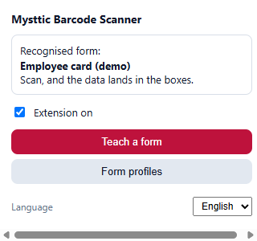
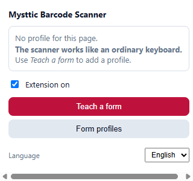

Clicking the icon shows which of the two states you are in: on the left a page
with a recognised profile (with an `ON` badge in the toolbar), on the right a
page without one, where the scanner types like an ordinary keyboard.

The scanner and its firmware are **left untouched**: the extension never talks to
the device, it only listens to the keyboard, because the scanner *is* a keyboard.
The demo form works with the factory configuration (passthrough plus ENTER).

## The algorithm

**When a page opens and on every view change in a single-page app:**

1. take the current address,
2. find the first enabled profile whose URL pattern matches,
3. check that the profile's required fields are actually in the DOM (this is what
   tells apart different forms living under the same address),
4. if they are, activate the profile; if not, go back to sleep.

**On a scan (only while a profile is active):**

5. characters arriving faster than `burstGapMs` (60 ms by default) come from a
   scanner, not a human, and go into the frame buffer (key auto-repeat is
   ignored). With a TAB profile the TABs of the series go into the buffer too,
   while a lone human TAB passes through normally,
6. ENTER ends the frame; a captured series with no ENTER is returned to the page
   after 350 ms of silence,
7. the frame goes to the parser selected by the profile's `parse.type`,
8. values are written into the fields from the `fields` map, and every field is
   **verified by reading it back**,
9. a summary toast appears and the fields are highlighted (green or red).

**When a frame fails to parse**, the extension hands the captured characters back
to the page, as if it had not been there. That is the guarantee of no
regression. With a prefix profile a TAB inside the frame still ends the capture
(it is a variant A sequence meant for another page); with a TAB profile the TABs
are part of the frame.

## Installation

1. Chrome or Edge → `chrome://extensions` (Edge: `edge://extensions`).
2. Turn on **Developer mode**.
3. **Load unpacked** → point at the `browser-extension/` directory from the
   release package (or from the repository).
4. Pin the icon to the toolbar. The `ON` badge marks a recognised form.

To test forms opened from disk (`file://`), enable **Allow access to file URLs**
in the extension's details. Simpler still: run a local server
(`python -m http.server 8124` inside `test-vectors`).

## First test

1. Open `test-vectors/forms/form-c-extension.html` (the *Employee card*,
   employee card, view).
2. The badge should show `ON` and a toast should flash in the corner: "Czytnik:
   Karta pracownika (demo)".

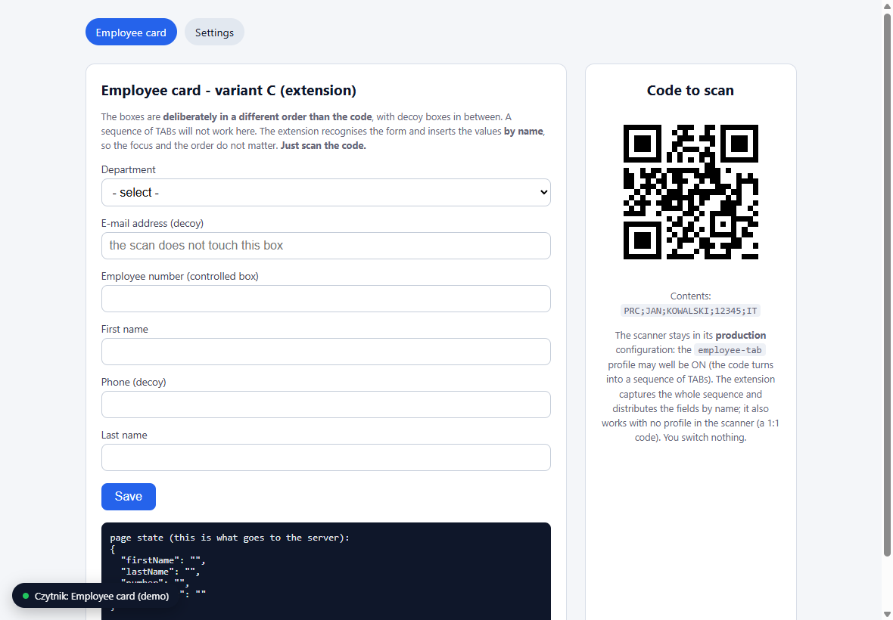

3. Scan the code from the page (`PRC;JAN;KOWALSKI;12345;IT`), **without clicking
   into any field**.
4. Four fields are filled by name, the decoy fields stay empty, and the "stan
   strony" (page state) panel shows that the page really did see the values.

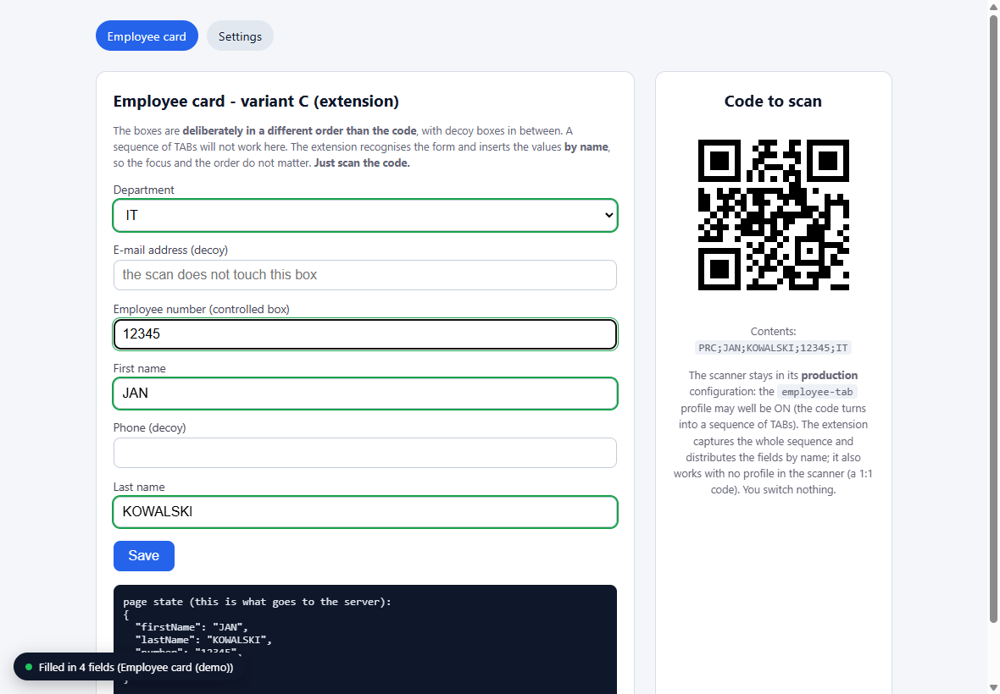

Notice three things at once: the data landed in the right fields despite being in
**a different order than in the code**, the decoy fields (e-mail, phone) stayed
empty, and `Department` is a `<select>` where the extension picked the
option by value. The panel at the bottom is the page's internal state: had the
extension only replaced `value` without firing events, it would have stayed empty
and the form would have been submitted with no data.

5. Switch to the *Settings* tab and the badge goes out. Click a
   field and scan: the code is typed raw, straight from the keyboard.

## A second example — a medicine order, and profiles switching

`test-vectors/forms/form-c-medicine.html` shows the full GS1 pipeline and the way
profiles (in the scanner and in the extension) select themselves per page:

1. The medicine box carries a **GS1 DataMatrix** (on the page: a code with the
   content of a real medicine, a GTIN with a valid check digit, expiry date
   `271000`, batch, serial number after a GS separator).
2. The **`medicine-extension` profile in the scanner** (present in the default
   configuration, needs enabling) parses GS1, converts the date (day "00" means
   the last day of the month, so `2027-10-31`) and types the frame
   `MED;gtin;date;batch;serial`. The GS separator cannot travel over a keyboard,
   so it is the scanner that marks the field boundaries.
3. **A second extension profile** (built in) recognises the order page and
   distributes the frame across the fields: the serial number and the expiry date
   end up in the right places despite the shuffled field order.

The switching is visible directly: on the *Employee card* page the employee
profile is active (a medicine scan fills nothing there), on the order page the
medicine profile is (an employee frame is handed back to the page). The badge and
the toast always say which profile fired. Note that the `gs1-datamatrix` profile
(TABs, variant A) catches the same codes as `medicine-extension`, so it has to be
disabled for this demo.

## Teaching it a new form

Learning mode adds support for **any form** without writing anything: you scan a
code, name its segments and click the fields they belong to. The profile works
immediately and can be exported to other workstations.

The walkthrough below uses the medicine order page
(`forms/form-c-medicine.html`, both on the `MYSTTIC` disk and in the repository).
The code is a GS1 DataMatrix like the one on a real box, and the scanner stays in
its normal production configuration, typing
`GTIN TAB date TAB batch TAB serial-number ENTER`. What you teach the extension is
what to do with that sequence on this particular page.

> For the exercise, switch off the built-in demo profile for this page
> ("Medicine order (demo)" under **Form profiles**), otherwise it fills the
> form before your profile gets a chance: the first matching profile wins.

**Step 1 — start learning and scan.** Extension icon → **Teach a form**. Scan the code; the characters **do not reach the form**, the extension
only observes them. You are teaching from what the **scanner types**, so if its
profile produces a TAB sequence, learning captures the whole series and splits it
on the tabs.

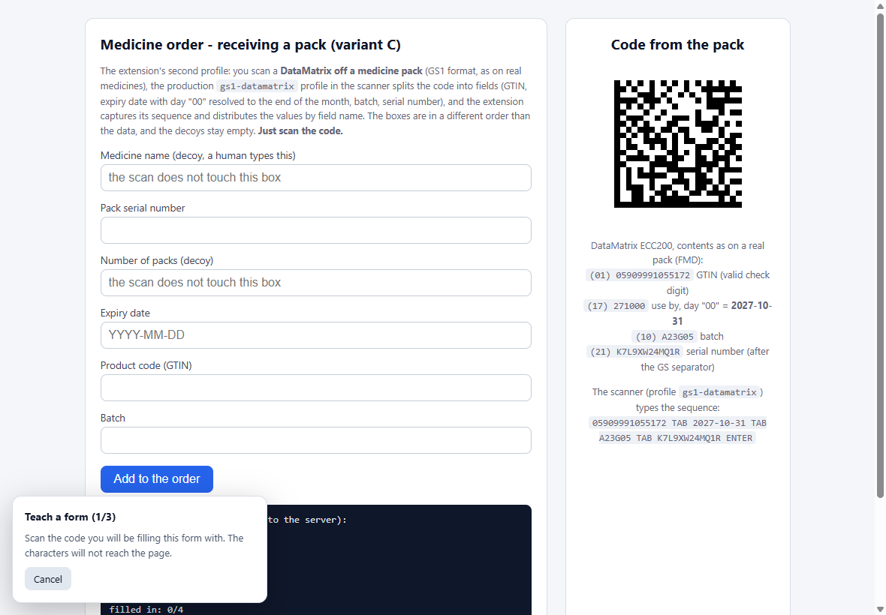

**Step 2 — name the segments.** The extension has already cut up what the scanner
typed (recognising the separator among `;` `|` `,` and tab) and shows the
segments: your values on the left, name fields on the right. Type names that mean
something to you, here `gtin`, `expiry`, `batch`, `serial`. Mark a
segment that should be skipped, a fixed prefix for instance, with `_`.

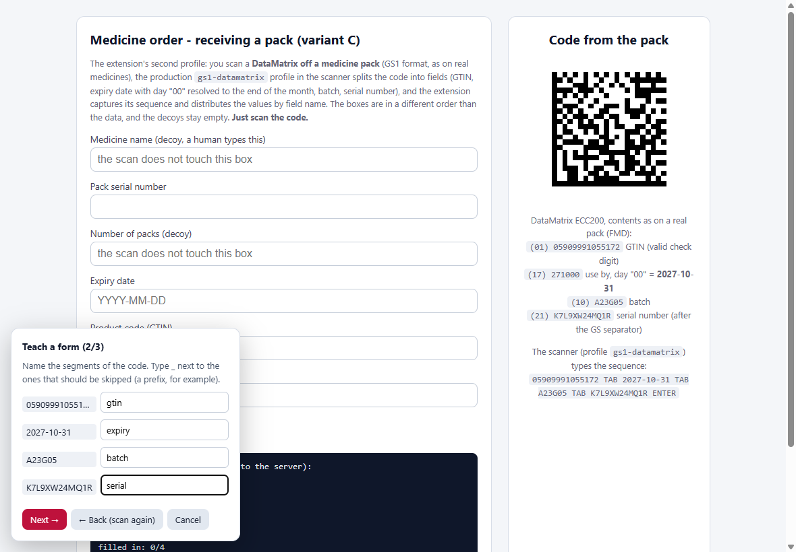

**Step 3 — point at the fields and confirm.** The wizard asks about each name in
turn and shows the value that will go there. Move over the form (the field under
the cursor is highlighted) and click the right one. A click **selects** the field
(a permanent green outline) but does not advance on its own; the panel waits for a
decision:

- **Confirm and continue** (Confirm and continue) saves the assignment and moves on,
- **Pick another box** (Pick another field) — misclicked? just click a different one,
- **← Wstecz** (Back) returns to the previous name, so you can fix an earlier choice,
- **Skip the box** — this name has no counterpart on this form.

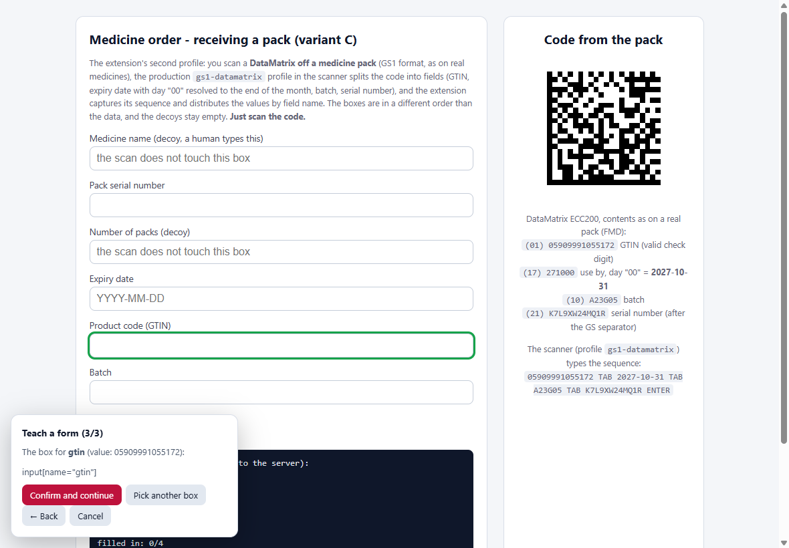

When a value looks like a date, the panel adds a row of buttons previewing
formats on your value, plus a field for your own pattern with a live preview — so
you pick a finished result instead of inventing a pattern. See
[Formatting the outgoing value](#formatting-the-outgoing-value).

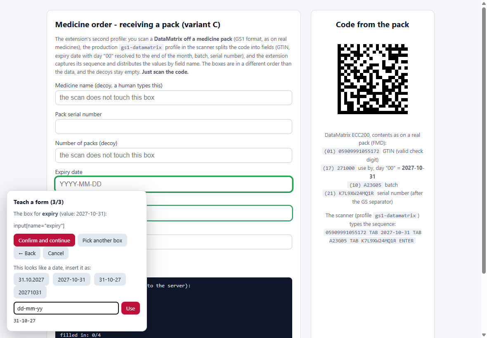

**Step 4 — save.** Give the profile a name and check the suggested **address
pattern**; the profile will only activate on matching pages (`*` stands for any
fragment). **← Wstecz** returns to the last field if you want to correct
something. Click **Save and enable**.

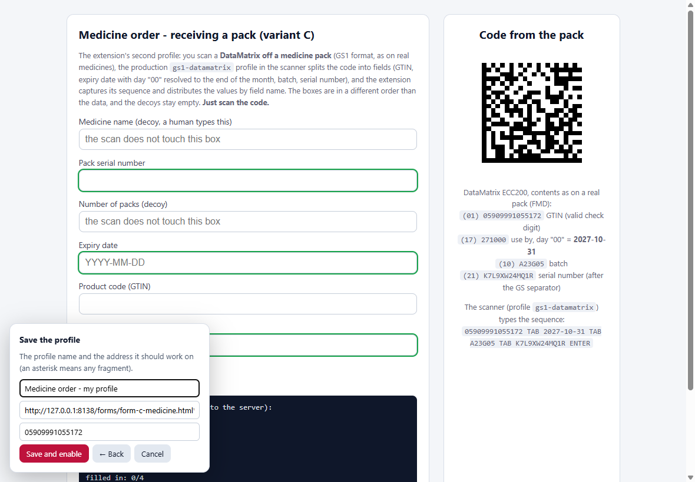

**Step 5 — check it.** Scan the same code again without clicking into any field:
the values land where they belong despite the shuffled field order, the decoy
fields stay empty, and a toast confirms which profile fired. The "stan strony"
(page state) panel at the bottom shows that the form really accepted the values.

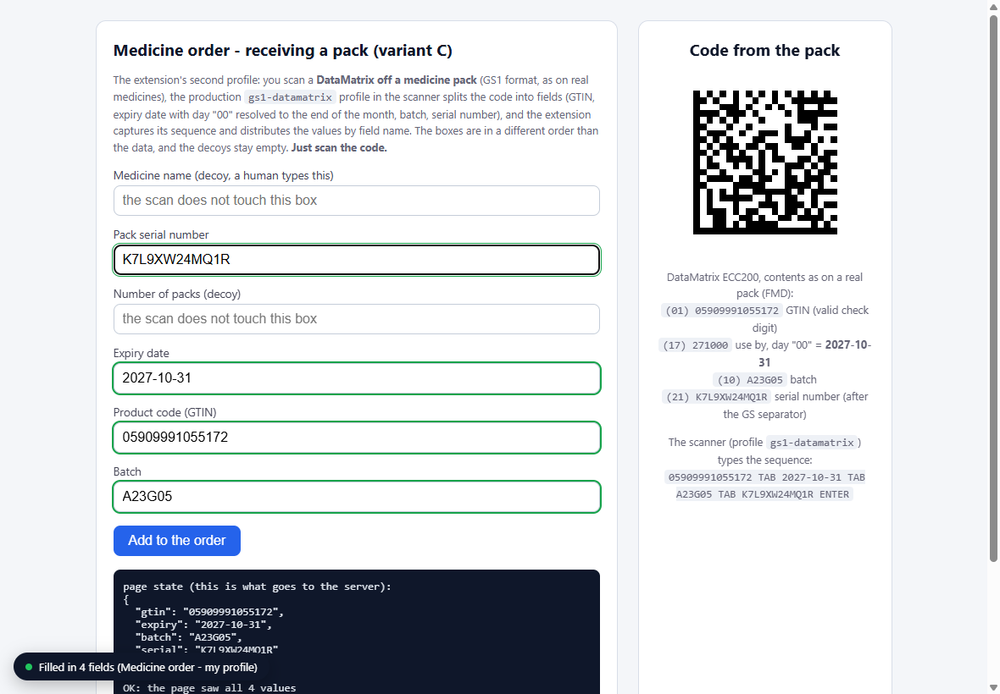

The profile is stored locally and works immediately. Finished profiles can be
exported to a file (**Form profiles** → *Eksportuj*) and distributed to
other workstations.

## Form profiles — adding and managing

There are two ways to add a profile:

- **learning mode** (recommended): open the form, extension icon → **Ucz
  formularza**, the three steps above; the profile works immediately,
- **import**: load a JSON file exported on another workstation (provisioning:
  one engineer teaches, everyone else imports).

Management: extension icon → **Form profiles**. For each
profile, directly in the list:

| Operation | How |
|---|---|
| rename | type in the name field, it saves itself when the field loses focus |
| change the address (where it works) | the "adres" field, a pattern with `*`, for example `https://erp.company.com/receiving*` |
| enable / disable | the "enabled" checkbox (a disabled profile stays in the list) |
| order | the ▲▼ arrows: when several profiles match a page, **the first one wins** |
| duplicate | "Duplicate", a copy to adapt (say, the same form under a second address) |
| delete | "Delete", with a confirmation |

Fields, selectors and parsing are edited in the **Konfiguracja (JSON)** section
below the list (the whole configuration, for manual editing), or simply teach the
profile again and delete the old one. **Eksportuj/Importuj do pliku** moves the
whole set between workstations; **Restore the defaults** goes
back to the two demo profiles.

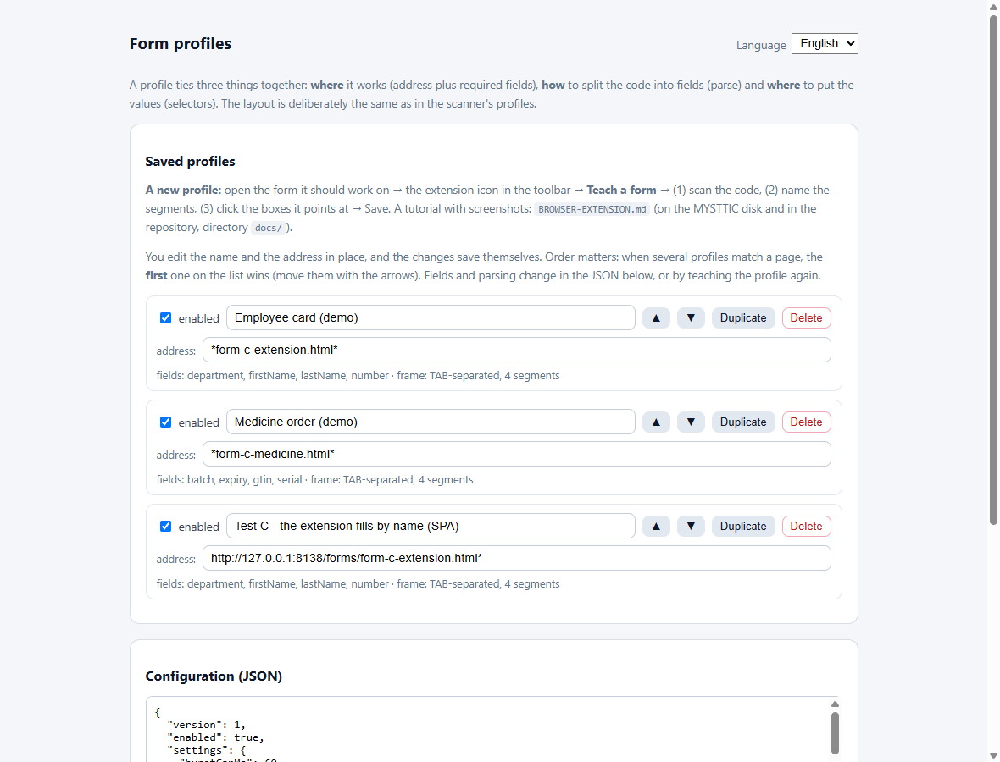

## Profile format

Deliberately a twin of the profile in the scanner: *where* → *how to split* →
*where to put it*.

```json
{
  "id": "erp-przyjecie",
  "name": "Goods receipt - ERP",
  "enabled": true,
  "match": {
    "urlPattern": "https://erp.firma.pl/magazyn/przyjecie*",
    "requiredFields": ["gtin", "batch"]
  },
  "parse": {
    "type": "delimited",
    "prefix": "PRC;",
    "separator": ";",
    "fields": ["_", "firstName", "lastName", "number", "department"]
  },
  "fields": {
    "firstName": "input[name=firstName]",
    "department": "select[name=department]"
  },
  "after": { "action": "none" }
}
```

| Field | Meaning |
|---|---|
| `match.urlPattern` | address pattern; `*` stands for any fragment |
| `match.requiredFields` | field names that must exist in the DOM for the profile to activate |
| `parse.type` | `delimited` (segments), `regex` (groups, as in the device) or `gs1` |
| `parse.prefix` | the start of the frame; while it matches, characters do not reach the page |
| `parse.separator` | segment separator; **`"\t"` means a TAB frame** (the sequence from a device profile, so the scanner stays in its production configuration) |
| `parse.segmentPatterns` | optional per-field patterns (for example `{"gtin": "^[0-9]{14}$"}`); without a prefix they tell apart frames of different profiles, and a frame with no prefix also has to have EXACTLY the right number of segments |
| `fields` | a map of `field name → CSS selector`, or `{selector, format, transform}` (see below) |
| `after.action` | `none` (default), `focus` plus `selector`, or `submit` |

The `regex` type takes `pattern` and `fields` as a map of `name → group number`,
exactly like `parse.regexGroups` in the scanner's configuration, so a profile can
be transcribed one to one.

## Formatting the outgoing value

Data in a code rarely has the shape a form wants: a GS1 date arrives as
`YYYY-MM-DD` (or `YYMMDD` from the raw code) while the system expects
`DD.MM.YYYY`; a product code may be a 14-digit GTIN while the field takes a
13-digit EAN. None of that requires changing the codes or the scanner's
configuration. It is enough to expand a profile field from a bare selector into
an object:

```json
"fields": {
  "expiry": { "selector": "input[name=termin]", "format": "DD.MM.RRRR" },
  "gtin":         { "selector": "#ean", "transform": ["gtin13"] },
  "batch":       "#lot"
}
```

The two forms can be mixed; a plain selector keeps working as before.

### Dates and time

`format` is **any pattern** built from tokens; everything else passes through
unchanged. Case does not matter, `DD-MM-RR` and `dd-mm-yy` mean the same thing.
The Polish token letters (`RRRR` for the year) work alongside the English
ones, so profiles taught with the Polish interface keep working.

| Token | Meaning | Example |
|---|---|---|
| `RRRR` / `YYYY` | four-digit year | `2027` |
| `RR` / `YY` | two-digit year | `27` |
| `MM` / `M` | month (padded / bare) | `03` / `3` |
| `DD` / `D` | day (padded / bare) | `07` / `7` |
| `HH` / `H` | hour, 24-hour clock | `09` / `9` |
| `MI` | minutes | `05` |
| `SS` / `S` | seconds | `00` / `0` |

| Pattern | Result for `2027-10-31 14:05` |
|---|---|
| `dd-mm-yy` | `31-10-27` |
| `DD.MM.RRRR` | `31.10.2027` |
| `RRRR-MM-DD HH:MI` | `2027-10-31 14:05` |
| `D.M.RRRR` | `31.10.2027` (for 7 March: `7.3.2027`) |
| `RRRRMMDD` | `20271031` |
| `HH:MI:SS` | `14:05:00` |

**Minutes versus month.** `MM` means month, with one exception: if an hour token
appeared earlier in the pattern, the next `MM` is read as minutes, because
`HH:mm` means the same thing in every system. That way `dd-mm-yy` gives
day-month-year while `RRRR-MM-DD HH:mm` gives a correct timestamp. When you want
to be sure, use `MI`, which always means minutes.

**Literal text.** Letters are tokens, so wrap your own text in apostrophes:
`DD.MM.RRRR 'godz.' HH:MI` gives `31.10.2027 godz. 14:05`. A doubled apostrophe
(`''`) produces a single `'`.

**What is recognised on input:** `YYYY-MM-DD`, `DD.MM.YYYY` (also with `/` and
`-`), `YYYYMMDD`, GS1 `YYMMDD` (with the "day 00 means the last day of the
month" rule), the same shapes with a time after a space or a `T` (`14:05` or
`14:05:09`), the strings `YYYYMMDDHHMM` and `YYMMDDHHMM`, and a bare time
`HH:MM[:SS]`.

Two safeguards against silently corrupting data: a value that is neither a date
nor a time passes through **untouched** (a `format` typed on the wrong field
breaks nothing), and a date pattern applied to a time-only value returns the
value unchanged instead of writing `00-00-0000`.

**HTML controls with a format of their own** get what they require regardless of
the pattern in the profile: `input[type=date]` gets `YYYY-MM-DD`,
`input[type=time]` gets `HH:MM`, `input[type=datetime-local]` gets
`YYYY-MM-DDTHH:MM`. The browser will display them in the system's own format
anyway.

### Other transformations

`transform` is a list of operations applied in order, after `format`:

| Operation | What it does |
|---|---|
| `gtin13` | a GTIN-14 with a leading zero becomes an EAN-13 |
| `digits` | keeps digits only (`A-22/B` becomes `22`) |
| `upper`, `lower`, `trim` | letter case, trimming spaces |
| `prefix:text`, `suffix:text` | glues text to the front or the back |
| `slice:from,to` | cuts out a fragment (as in JavaScript, zero-based) |

An unknown operation is skipped and does not interrupt the filling.

### In learning mode

None of this has to be typed by hand. If the value you pointed at looks like a
date, the confirmation panel adds a row of buttons **previewing the result on
your value**, so you click a finished result instead of inventing a pattern. Next
to them is a field for **your own pattern**, with a preview updating as you type,
so you see the effect before confirming. When the value also carries a time, the
suggestions include it. A plain **Confirm and continue** inserts the value
unchanged, so the rest of the wizard behaves the same:


## GS1 codes

The firmware filters out non-printable characters, so **the GS separator (0x1D)
does not travel over the keyboard** and a parser would have no way of finding the
boundaries of variable-length fields (AI 10 and 21). The ways out:

- **recommended:** keep a production GS1 profile with a TAB sequence in the
  scanner (for example `gs1-datamatrix`) and use a TAB frame in the extension
  (`parse.separator: "\t"`). The scanner marks the field boundaries and nothing
  gets switched;
- a scanner profile that types the fields separated by a visible character
  (`field` actions interleaved with `text ";"`, like `medicine-extension` in the default
  configuration) plus `parse.type: "delimited"` with a prefix;
- or set `parse.gsChar` to the character that separates the fields in the code.

The GS1 parser itself (AI 01/17/10/21, day "00" meaning the last day of the
month, stripping the AIM ID) is a port of the firmware one and passes the same
test vectors.

## Settings

In **Form profiles** → JSON, the `settings` section:

| Key | Default | Meaning |
|---|---|---|
| `burstGapMs` | 60 | the longest gap between characters still counted as a scan |
| `minFrameLength` | 3 | shorter frames are ignored |
| `highlight` | `true` | highlight the filled fields |

## Limits and safety

- The extension **never goes to the network**: it has no network permissions, and
  everything (profiles, scans) stays locally in the browser.
- It never fills `password` fields.
- A closed Shadow DOM is out of reach for selectors, so such fields have to be
  filled with variant A (TABs).
- Typeahead fields that require picking from a list may need manual
  confirmation: the value is typed, but selecting from the list belongs to the
  page.
- Focus has to be inside the browser window. If the operator clicks outside it,
  the scan goes wherever the caret is, exactly like an ordinary keyboard.

## Tests

```bash
cd browser-extension
npm ci
npm test         # parsing, formats, address matching (96 assertions)
npm run test:e2e # Chromium with the extension loaded plus the demo form
npm run shots    # regenerate the screenshots on this page (docs/img/extension-*.png)
```

The e2e test checks three things at once: filling a recognised form (including
the page's own state, not only `value`), the extension staying silent on a view
with no profile, and handing a foreign code back to the page. Both tests run in
CI on every pull request to `master`.
