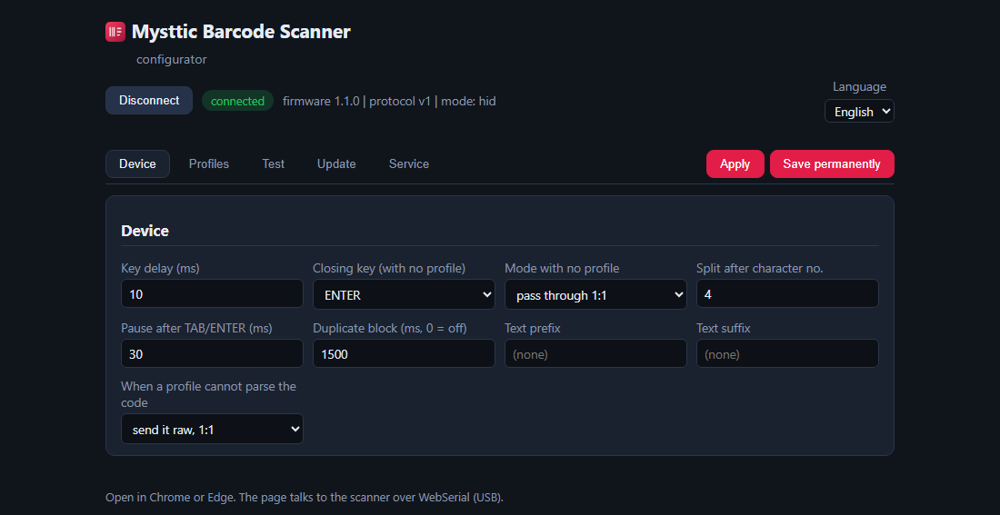
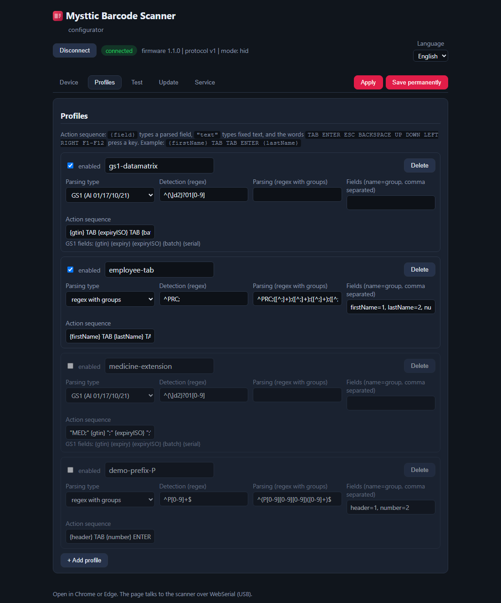
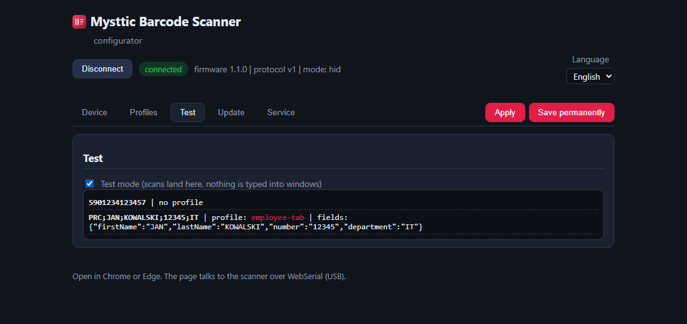
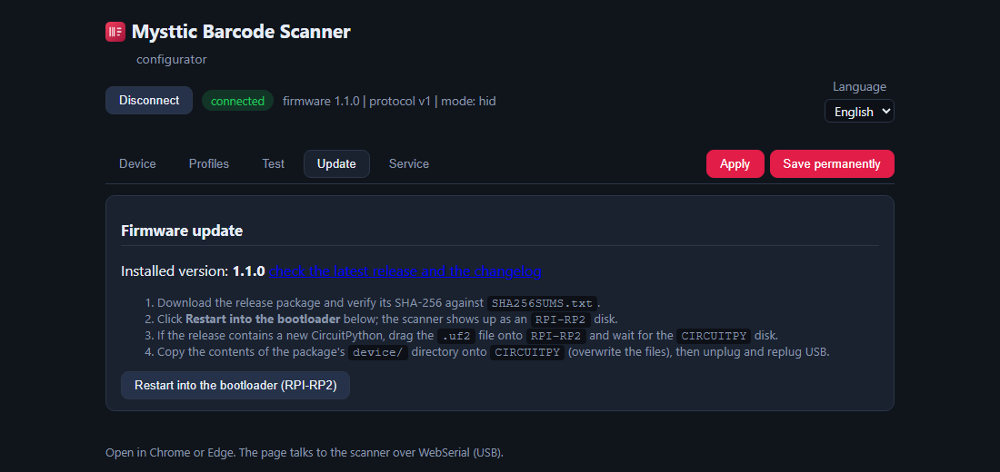
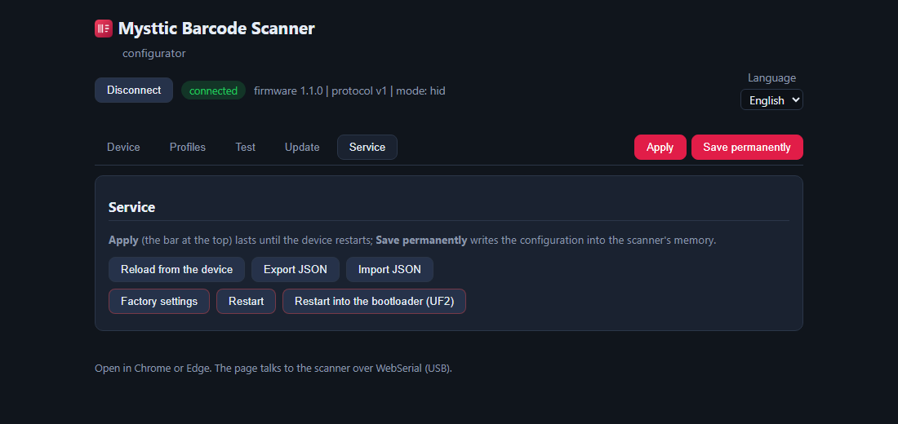

# Scanning configuration and profiles

The configurator's interface is in English; the language selector in its top
right corner also offers Polish. The tabs below appear in the order they are
shown on screen.

## Connecting to the configurator

1. Open **`configurator.html`** from the scanner's disk in Chrome or Edge. The
   copy from the release package or from the repository works the same way.
2. Click **Connect** and pick the "USB serial device" port:
   - production firmware (C): there is **one** port,
   - prototype firmware (CircuitPython): pick the **second** of the two (the
     first is the console, so a timeout on connecting means you should switch to
     the other one).
3. The header shows the firmware version and the operating mode, and a tab bar
   appears below it: **Device · Profiles · Test · Update · Service**
   (Device, Profiles, Test, Update, Service).

The **Apply** and **Save permanently** buttons are
always visible on the right of the tab bar and cover the whole configuration,
from every tab at once:

- **Apply** sends the configuration to RAM. It takes effect immediately and
  disappears when the device loses power. For quick experiments.
- **Save permanently** stores the configuration in the scanner's memory. It survives
  restarts and firmware updates.

## The "Device" tab



Global settings that apply regardless of profiles:

| Setting | Meaning |
|---|---|
| Key delay (ms) | pause between characters; raise it when an application drops characters |
| Closing key (with no profile) | what to press after a code with no profile; usually ENTER |
| Tryb bez profilu — no-profile mode | what to do with a code matching no profile: type it verbatim, or split it (`splitAt`) |
| Split after character no. | where to cut in "split" mode (code → part 1, TAB, part 2) |
| Pauza po TAB/ENTER (ms) | extra time for focus to move in slow applications |
| Duplicate block (ms) | the same code within this window is typed once (0 disables it) |
| Prefiks / sufiks tekstowy | fixed text glued before or after the code (no-profile mode) |
| Gdy profil nie sparsuje kodu | when a profile fails to parse: send it raw, or drop the scan |

The screenshot shows the factory settings: 10 ms between characters, 30 ms after
TAB and ENTER, duplicate blocking at 1.5 s, and codes without a profile typed
verbatim and finished with ENTER.

## The "Profile" (Profiles) tab — the heart of the device



A profile says **which codes to catch** (detection), **how to cut them into
fields** (parsing) and **what to type** (the action sequence). Codes matching no
enabled profile are typed verbatim.

**Out of the factory, every profile is disabled**, so the scanner types codes
verbatim until you enable one. The screenshot shows the state after enabling the
two production profiles, which is what the test scenario in
[CONTRIBUTING.md](CONTRIBUTING.md) asks for:

- **gs1-datamatrix** (enabled here) catches codes starting with AI `01` (with an
  optional `]d2` symbology identifier), parses them with the built-in GS1 parser
  and types `{gtin} TAB {expiryISO}`,
- **employee-tab** (enabled here) catches `PRC;…` codes, cuts them on semicolons
  with a group regex into the fields `firstName, lastName, number, department` and fills the
  form with TABs,
- **medicine-extension** (disabled) is the medicine-order variant: it parses the same
  GS1 codes but types a `MED;…` frame instead of TABs. It collides with
  `gs1-datamatrix`, so only one of the two can be enabled at a time,
- **demo-prefix-P** (disabled) is a template example. Disabled profiles stay in
  the configuration but do nothing.

Profile fields:

- **enabled**: the profile only works with the checkbox ticked,
- **Wykrywanie (regex)** (detection): a pattern matched against the start of the
  code, `^PRC;` for example,
- **Typ parsowania** (parsing type):
  - *regex z grupami* (regex with groups): a pattern with parentheses, such as
    `^PRC;([^;]+);([^;]+);([^;]+);([^;]+)$`, plus a **Pola** (fields) map:
    `firstName=1, lastName=2, number=3, department=4`,
  - *GS1 (AI 01/17/10/21)*: the built-in GS1 parser, with fixed fields
    `{gtin} {expiry} {expiryISO} {batch} {serial}` (a hint
    listing them appears under the sequence),
- **Sekwencja akcji** (action sequence): what the scanner will type,
  - `{field}` types the value of a field,
  - `"text"` types fixed text,
  - `TAB ENTER ESC BACKSPACE UP DOWN LEFT RIGHT F1`-`F12` press a key.

Example sequences:

```
{firstName} TAB {lastName} TAB {number} TAB {department} ENTER
{gtin} TAB {expiryISO} TAB {batch} TAB {serial} ENTER
{number} TAB TAB ENTER TAB {firstName} " " {lastName}
```

**+ Add profile** creates an empty card; **Delete** removes
one. Changes only take effect on "Apply" or "Save permanently", so a mistake can
be undone with "Reload from the device" on the Service tab.

A note on patterns: the on-device engine supports `^ $ . [] * + ? ()` and the
classes `\d \w \s`. Spell `{m,n}` quantifiers out (`[0-9][0-9][0-9]`); the
configurator enforces this on save.

## The "Test" tab



Tick **Tryb testowy** (test mode) and scan. Every scan appears in the log window
(raw content, matched profile, parsed fields) and **nothing is typed into any
window**, which is ideal for tuning profiles without damaging documents. Untick
it when you are done (it also switches itself off on disconnect).

### Test pages for live trials

To check the full path (scan → keyboard → form) there are ready-made pages in
the repository's [`test-vectors/`](../test-vectors/) directory. Open a file in a
browser, click the first field and scan the code printed or displayed on the same
page:

| Page | What it tests | Profile |
|---|---|---|
| [`form-a-tab.html`](../test-vectors/forms/form-a-tab.html) | a form filled in order with TABs | **employee-tab** |
| [`form-b-names.html`](../test-vectors/forms/form-b-names.html) | fields in a different order, so the sequence has to match the form's layout | **employee-tab** (with a modified sequence) |
| [`form-gs1.html`](../test-vectors/forms/form-gs1.html) | a pharmacy GS1 DataMatrix: GTIN, expiry date, batch, serial number | **gs1-datamatrix** |

Every page carries its own QR code to scan and a description of the expected
result. The full acceptance scenario: [CONTRIBUTING.md](CONTRIBUTING.md).

## The "Update" tab



Shows the installed firmware version with a link to the releases (and the
changelog) plus a condensed update procedure. The **Restart into the bootloader**
button puts the scanner into `RPI-RP2` disk mode without reaching for the BOOT
button on the board. Full instructions: [getting-started.md](getting-started.md).

## The "Service" tab



- **Reload from the device** discards the changes in the form
  and reads the scanner's current configuration,
- **Eksport / Import JSON** for backups and for moving a configuration between
  devices (provisioning),
- the red zone:
  - **Factory settings** clears the permanent copy, so the
    configuration falls back to the file or to the factory defaults,
  - **Restart** is a plain reboot of the scanner,
  - **Restart into the bootloader (UF2)** is the same as on the Update tab.

## Where configuration is stored, and what wins

Configuration sources in order of precedence: **the permanent copy → the
`config/config.json` file on the disk → factory settings**. Editing the file
makes sense when provisioning many devices; after the first "Save permanently" the
permanent copy wins, until "Factory settings".

## Factory settings (in hardware)

When the configurator is unavailable: hold the button wired to GP2 for about a
second while plugging in USB.

## Configuring the scanner module (once)

The module's own modes (UART output, scanning on presentation) are set with codes
from the module's manual (see [getting-started.md](getting-started.md) for where to get it).
Details in [getting-started.md](getting-started.md), section 3.
