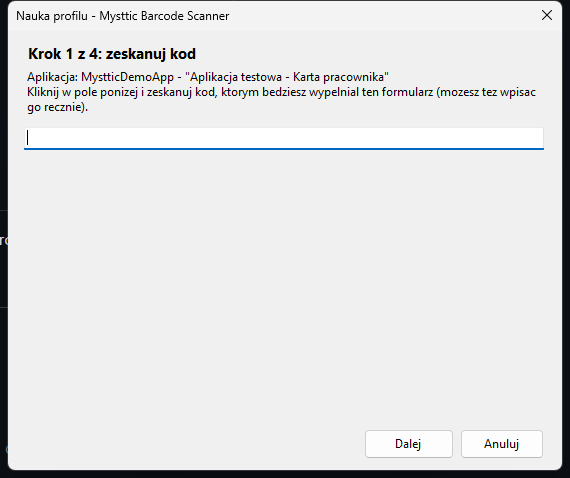
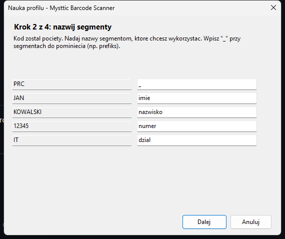
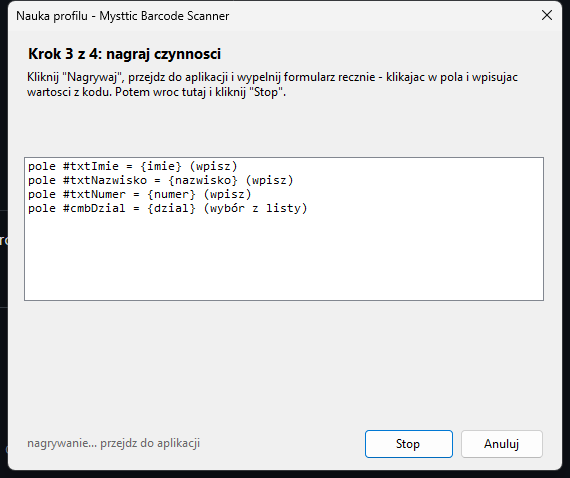
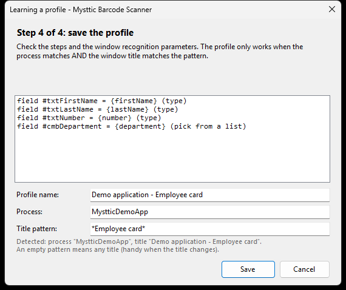
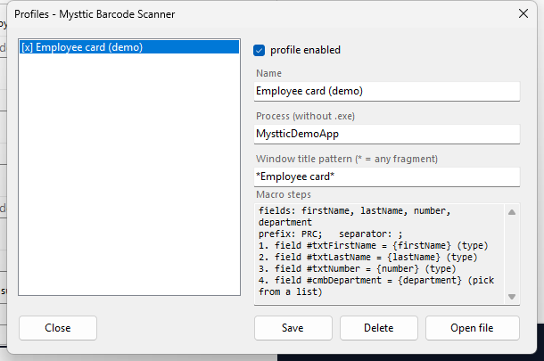

# Desktop agent — filling forms in applications

The browser extension only works in a browser. The desktop agent does the same
thing in **ordinary Windows applications**: it recognises the window, captures
the scan and replays a macro it was taught.

**The module is optional.** Without it the scanner behaves exactly as before
(variant A: TAB sequences). The agent is installed separately and only when a
customer needs it.

Its user interface is in Polish; Polish labels are given in brackets below.

> **Status: working prototype.** The path "scan → recognise the window → fill the
> fields" is covered by automated tests (34 unit assertions and 27 e2e ones
> against a live application, including a scan in the style of a real reader and
> a run against the files from a finished release package). It has not yet been
> checked with a physical scanner or in a real kiosk, which is the next step.

## How it works

| Situation | What the agent does | What the operator sees |
|---|---|---|
| the window matches a profile | captures the scan and replays the macro | a toast: "Wypełniono: kroki 4/4" (filled, 4 of 4 steps) |
| a window with no profile | **nothing**, it does not touch the keyboard | the scanner types as usual (TABs, passthrough) |

The second row matters as much as the first: outside the applications it was
taught, nothing changes. When a frame does not match a profile, the captured
characters go back to the application, as if the agent had not been there.

**The scanner and its firmware are left untouched.** The agent listens to the
keyboard, because the scanner *is* a keyboard, and it works with the device's
production configuration.

## How the agent hits the right field

Three strategies, tried in this order:

| Strategy | When it works | Durability |
|---|---|---|
| **UI Automation** (control identifier) | WinForms, WPF, WinUI, Electron, Qt or Java with accessibility enabled | high: survives moving the window, a different resolution and DPI scaling |
| **clicking coordinates** (relative to the window) | everywhere, including Citrix/RDP and applications that draw their own interface | low: a moved window means a click in the wrong place |
| **typing into the focused field** | when a step has no target (after a TAB, say) | depends on focus |

Learning records **both** pieces of information at once (the control identifier
and the position), so a profile only falls back to coordinates when the control
cannot be found.

On top of that, every fill is **verified by reading the value back**: the agent
checks that the application really accepted it, and reports an error instead of
quietly typing into the void.

## Installation

The agent is in the release package, in the **`desktop-agent/`** directory:

```
desktop-agent/
  MystticBarcodeAgent.exe   standalone program (no .NET installation needed)
  install-agent.ps1         installer: copies the agent and enables autostart
  example-profile.json      a ready-made profile to try
  DESKTOP-AGENT.md          this manual
  README.txt                the short version
```

**Installation (recommended):** right-click `install-agent.ps1` → *Run with
PowerShell*. The agent goes into your user profile
(`%LOCALAPPDATA%\MystticBarcodeScanner`), gets a Start menu shortcut and starts
with Windows. Administrator rights are not needed.

| Variant | Command |
|---|---|
| without autostart | `.\install-agent.ps1 -NoAutostart` |
| uninstall | `.\install-agent.ps1 -Uninstall` (profiles are kept) |
| no installation at all | run `MystticBarcodeAgent.exe` directly |

Once running, an icon appears in the system tray; its right-click menu has the
on/off switch, profile management and learning mode.

Profiles and the log live in `%APPDATA%\MystticBarcodeScanner\`
(`profile.json`, `agent.log`).

## The demo application (for trying it out without a production system)

Published alongside the release is a separate file,
**`demo-app-v<version>-win-x64.zip`**: a portable application with two screens
(a login form and an employee card). The fields are deliberately in a different
order than the data in the code, and there are decoy fields, a drop-down list, a
typeahead field and a password field. The panel at the bottom shows **what the
application really accepted**, not just what the fields display.

1. Unpack it and run `MystticDemoApp.exe` (no installation needed).
2. Copy `agent-profile.json` to
   `%APPDATA%\MystticBarcodeScanner\profile.json`, or teach your own profile
   (Ctrl+Alt+F9).
3. Scan the code `PRC;JAN;KOWALSKI;12345;IT;Specjalista`.

Kiosk mode for experiments: `MystticDemoApp.exe --kiosk`.

## Teaching a new form

Learning mode is started by the **global shortcut Ctrl+Alt+F9**, which also works
when the application runs full-screen in kiosk mode and the tray cannot be
clicked.

1. Open the form you want to teach and press **Ctrl+Alt+F9**.

2. **Step 1 — scan the code.** Click into the wizard's field and scan the code
   you will be filling this form with. The characters do not reach the form.



3. **Step 2 — name the segments.** The agent cuts the code up (choosing the
   separator itself); give the segments names and type `_` for the ones to skip,
   such as a prefix.



4. **Step 3 — record the actions.** Click "Nagrywaj" (Record), switch to the
   application and fill the form **by hand**: click into fields and type the
   values from the code, use TAB and ENTER as usual. Then come back and click
   "Stop". The list shows what the agent has memorised as you go.



5. **Step 4 — save.** The agent turns the typed values into `{field}`
   references, merges "click plus type" into one durable step carrying the
   control identifier, and shows the finished list of steps. Here you also see
   the **window matching parameters** (profile name, process and title pattern),
   all editable before saving. An empty title pattern means any title, which is
   what you want for applications that change their window title (media players,
   browsers).



The wizard appears in the **bottom right corner** of the screen the application
being taught is on, so it does not cover the form.

**The way you teach decides the way it fills.** If you *typed* text into a field,
the agent will type too; if you *picked an item from a list*, the agent will pick.
The distinction matters for search fields with suggestions: in the control tree
they look like drop-down lists, even though they are plain text boxes.

From that moment a scan alone fills the form, and **the profile works
immediately, with no agent restart**. The same goes for changes made directly in
`profile.json`: the agent watches the file and reloads it after a save, which is
handy when provisioning workstations with a ready-made file.

## Managing profiles

Tray icon → **Profile (zarządzaj)** (Profiles, manage): enabling and disabling a
profile, renaming it, correcting the **process and the window title pattern**,
previewing the macro steps and deleting. The *Otwórz plik* (Open file) button
reveals `profile.json` for manual editing or for copying to other workstations.



## Profile format

Deliberately a twin of the extension profile: *where* → *how to split the code* →
*what to do*.

```json
{
  "Nazwa": "Karta pracownika (ERP)",
  "Wlaczony": true,
  "Match": { "Proces": "erp", "TytulWzorzec": "*Karta pracownika*" },
  "Parse": {
    "Typ": "delimited",
    "Prefiks": "PRC;",
    "Separator": ";",
    "Pola": ["_", "imie", "nazwisko", "numer", "dzial"]
  },
  "Kroki": [
    { "Akcja": "pole", "Cel": { "AutomationId": "txtImie" }, "Wartosc": "{imie}", "Tryb": "wpisz" },
    { "Akcja": "pole", "Cel": { "AutomationId": "cmbDzial" }, "Wartosc": "{dzial}", "Tryb": "wybierz" },
    { "Akcja": "klawisz", "Klawisz": "TAB" },
    { "Akcja": "tekst", "Wartosc": "kadry" },
    { "Akcja": "klik", "Cel": { "X": 120, "Y": 380 } },
    { "Akcja": "pauza", "Ms": 200 }
  ]
}
```

The keys are Polish, matching the rest of the codebase.

| Action (`Akcja`) | Meaning |
|---|---|
| `pole` | type a value (a template with `{field}`) into the given control; `Tryb` is `wpisz` (type), `wybierz` (pick from a list) or `auto` |
| `tekst` | type text wherever the caret is |
| `klawisz` | TAB, ENTER, ESC, F1-F12, arrows, HOME/END, DELETE, BACKSPACE |
| `klik` | click a control or a point (coordinates relative to the window) |
| `pauza` | wait the given number of milliseconds (for slow applications) |

Parsing types (`Parse.Typ`): `delimited`, `regex` (groups, as in the device) and
`gs1` (AI 01/17/10/21, day "00" meaning the end of the month), the same rules and
the same test vectors as the firmware and the extension.

## Settings

The `Ustawienia` section of `profile.json`:

| Key | Default | Meaning |
|---|---|---|
| `OdstepSkanuMs` | 60 | the longest gap between characters still counted as a scan |
| `MinDlugoscRamki` | 3 | shorter frames are ignored |
| `PauzaKrokuMs` | 40 | pause between macro steps (raise it for slow applications) |
| `WeryfikujOdczytem` | true | confirm each fill by reading the value back |

## Limits

- **An application running as administrator** requires the agent to run elevated
  as well (the UIPI mechanism), otherwise it cannot type into it.
- **Citrix/RDP and applications that draw their own interface** expose no
  controls to UI Automation, which leaves the coordinate variant (fragile) or a
  TAB sequence from a scanner profile.
- **Password fields are never filled** (a deliberate limitation).
- The agent installs a keyboard hook, and some corporate policies and antivirus
  packages block that. The intended alternative is receiving data over the
  scanner's serial channel (`host` mode), with no hook, see
  [roadmap.md](roadmap.md).
- After an application update the control identifiers may change and the profile
  has to be taught again.

## Diagnostics

`%APPDATA%\MystticBarcodeScanner\agent.log` records every recognised frame and
the result of every macro step. To find out whether a given application is
suitable for targeting by identifiers at all:

```bash
MystticBarcodeAgent.exe --drzewo --proces process_name
```

If the controls have empty `id` and `nazwa`, the profile will have to rely on
coordinates or on a TAB sequence.
